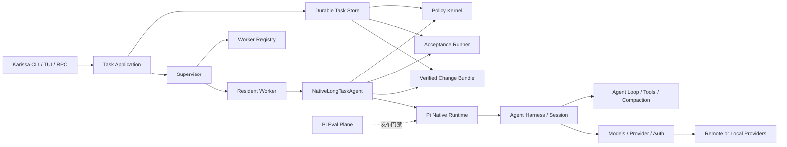

# Karissa 架构优化规格

> 状态：Draft
>
> 日期：2026-08-12
>
> 目标版本：V0.1 起分阶段实现
>
> 关联文档：[KARISSA_PRD_V0.1.md](./KARISSA_PRD_V0.1.md)、[NATIVE_LONG_TASK_AGENT_ARCHITECTURE.md](./NATIVE_LONG_TASK_AGENT_ARCHITECTURE.md)、[TECHNICAL_SPEC.md](./TECHNICAL_SPEC.md)、[LONG_RUNNING_CONTROL_PLANE_SPEC.md](./LONG_RUNNING_CONTROL_PLANE_SPEC.md)

## 1. 架构决策

Karissa 基于 Pi Agent 深度开发。Pi 是 Karissa 的原生执行内核，继续负责模型 Provider、认证、模型目录、流式协议、Agent Loop、Session、工具、Extension、上下文压缩和 Eval。Karissa 在 Pi 的原生 seam 上增加持久 Task、常驻 Worker、预算、策略、恢复和验收。

V0.1 采用以下决定：

1. Task 是 Karissa 的顶层实体，Session 是 Task 内一次 Attempt 的执行记录。
2. `NativeLongTaskAgent` 是唯一长程执行模块，内部直接拥有 Pi Harness 和 Pi Session。
3. 不增加 `AgentBackend`、`ProviderGateway` 或第二套生命周期协议。
4. 长程正确性进入 Pi Harness 的 awaited hooks，不再由内置 Extension、环境变量和异步 listener 拼装。
5. Pi Session log 保存会话事实，Karissa Task Store 保存跨进程任务事实。两者通过稳定 ID 和 settled checkpoint 绑定，不复制两套恢复状态机。
6. Provider 路由和成本策略复用 Pi `Models` 与 `Provider`。未来的 Karissa Managed Provider 也实现为 Pi Provider。
7. Pi Eval 继续作为统一 Eval 基础设施。Acceptance 只判断一个 Task 是否完成。
8. Karissa 的公开执行入口全部创建或操作持久 Task，不保留公开的 transient Session 模式。

## 2. 设计范围

### 2.1 目标

- 终端关闭、客户端断线、Worker 崩溃和进程重启后，Task 仍能恢复。
- 恢复只从 Pi Session 的 settled checkpoint 开始。
- 工具调用、Provider 请求和用户控制命令都具有可审计的持久记录。
- 旧 Worker 未确认退出时，新 Worker 不能继续执行。
- 无法确认结果的工具或 Provider 调用进入 `unknown_outcome`，系统不自动重放。
- 预算、deadline、Provider allowlist、隐私策略和验收条件由主机侧执行。
- 用户 Extension 可以增加工具、Prompt 和资源，但不能修改 Task 状态或降低安全策略。
- 所有 Karissa 执行路径都能追溯到 Task ID、Attempt ID 和 execution ID。

### 2.2 非目标

- V0.1 不接入 Codex CLI、Claude Code CLI 或其他 Agent Backend。
- 不建立通用 Agent Backend 市场或能力协商协议。
- 不在 Attempt 运行中切换 Agent 内核。
- 不重新实现 Pi Provider、认证、模型发现、流式协议或 Eval。
- 不让模型文本直接决定 Task 完成。
- 不实现多 Agent、Cron、团队控制台、余额充值和发票系统。
- 不保证任意外部副作用都能自动恢复。无法核对的结果必须等待用户处理。

## 3. 规范关系

本规格定义 V0.1 的架构方向。已有规范继续提供详细状态机和协议，但出现冲突时按下表处理。

| 主题 | 权威来源 | 本规格的调整 |
| --- | --- | --- |
| Task、Attempt、checkpoint、budget、tool durability | `TECHNICAL_SPEC.md` | V0.1 固定为单 Main Agent，删除 `longTasks.enabled` |
| Supervisor、Worker、命令日志、事件重连、recovery barrier | `LONG_RUNNING_CONTROL_PLANE_SPEC.md` | 保留协议，V0.1 不实现 Cron 和多 Agent 调度 |
| Pi 与 Karissa 的模块关系 | 本规格 | Pi 是原生内核，不是可替换 Backend |
| Provider 与模型调用 | Pi `packages/ai` | Karissa 只增加路由策略和费用账本 |
| Eval | Pi `packages/evals` | 增加长程恢复、成本和质量评测，不另建框架 |
| 产品范围和验收指标 | `KARISSA_PRD_V0.1.md` | 本规格不扩大产品范围 |

被本规格明确取代的旧设计包括：公开 transient Session、`longTasks.enabled`、任务模式环境变量、内置长任务 Extension，以及把 Pi 包装成通用 Agent Backend 的方案。

## 4. 目标架构



执行链只有一份：

```text
Task
  -> Attempt claim
  -> Resident Worker
  -> NativeLongTaskAgent
  -> Pi Harness / Session
  -> Pi Models / Provider
```

Task Store 不解释 Provider 流或 Pi 内部事件。Pi Runtime 也不直接修改 Task 状态。`NativeLongTaskAgent` 在 Pi 的 awaited hooks 上提交跨进程事实，把两边连接起来。

## 5. Pi Native Runtime

Pi Native Runtime 是 Karissa 的执行底座，包含以下现有能力：

- `packages/ai`：Provider 注册、认证、模型发现、流式调用、普通完成调用和 deferred 请求。
- `packages/agent`：Agent Loop、工具调用、上下文转换和 Harness 生命周期。
- `packages/coding-agent`：Session、Extension、工具资源、compaction 和交互运行时。
- `packages/evals`：Pi Harness、质量评分、对比实验、成本与延迟统计、可恢复 benchmark。

Karissa 对 Pi 的改动应进入这些原生 seam，不在外面镜像一套 BackendEvent：

- 补齐并严格等待 `before_request`、`after_response`、`before_tool`、`after_tool`、`before_compaction` 和 settled hook。
- hook 接收稳定的 request ID、operation ID、Attempt identity 和 execution permit。
- 工具 adapter 只能在 `before_tool` 返回 permit 后执行。
- Provider 请求只能在 `before_request` 完成预算预留后发出。
- Session 只有在 settled 状态下才能导出可恢复 checkpoint。

Pi SDK 仍可独立创建普通 Session。这个兼容面属于 Pi，不属于 Karissa 的公开产品入口。

## 6. Karissa 长程运行模块

### 6.1 Task Application

Task Application 是 CLI、TUI、JSON 和 RPC 的共同入口，负责：

- 创建 Task 和 AcceptancePlan。
- 提交、查询和去重控制命令。
- 返回 Task snapshot 和可重连事件流。
- 让所有变更命令先进入 Command Journal。

它不创建 Pi Session，也不直接调用 Worker。

### 6.2 Task Control Plane

Task Control Plane 负责：

- Task、Attempt、lease、checkpoint、budget、inbox 和 command journal。
- Task 状态机与唯一活跃 Attempt。
- Attempt claim 和 fencing token。
- 等待、暂停、恢复、取消和人工确认。

它不理解 Pi 消息格式、Provider 事件或工具实现。

### 6.3 Supervisor 与 Worker Registry

Supervisor 管理 Worker 进程，不执行 Agent Loop。Worker Registry 保存不可复用的执行身份：

- worker generation；
- execution ID；
- PID、进程组和启动时间；
- sandbox ID 与运行配置 hash；
- heartbeat、lease owner 和 fencing token。

Supervisor 负责启动、观察、终止和确认旧执行体退出。仅凭 PID 或 lease 过期不能证明 Worker 已经停止。

### 6.4 Resident Worker

Resident Worker 领取一个 `ClaimedAttempt`，持有 lease 并运行 `NativeLongTaskAgent`。它负责：

- 定期续租并在每个外部动作前重新校验 fencing token；
- 消费已持久化的控制命令和 inbox；
- 将 pause、stop、cancel 转换成 Pi Runtime 内部的安全中断；
- 进程退出前请求 settled checkpoint；
- lease 失效后停止进入下一次 Provider 或工具调用。

Worker 不组装 policy、budget、checkpoint 和 runtime snapshot。它只传递 Task Control Plane 生成的不透明 Attempt claim。

### 6.5 NativeLongTaskAgent

`NativeLongTaskAgent` 是核心深模块。调用方只需要知道一个接口：

```ts
interface NativeLongTaskAgent {
  run(claim: ClaimedAttempt): Promise<AttemptOutcome>;
}
```

`ClaimedAttempt` 只能由 Task Control Plane 在事务中创建。它对调用方不公开 lease、fencing token、budget reservation、checkpoint、policy 和 continuation 的内部结构。

模块内部负责：

- 校验 Attempt claim 并加载不可变运行快照；
- 创建或恢复 Pi Harness 和 Pi Session；
- 安装 Karissa durable hooks；
- 驱动预算、工具安全、checkpoint、continuation 和 recovery；
- 运行 AcceptancePlan；
- 生成 Verified Change Bundle；
- 将结果归约为明确的 `AttemptOutcome`。

停止、转向和暂停不通过公开 `close()` 或 `control()` 直接调用。控制命令先持久化，Worker 消费后再触发内部 abort 或 safe-turn delivery。

### 6.6 Policy Kernel

Policy Kernel 在主机侧判断：

- 工具风险和授权；
- sandbox、cwd、网络与凭据范围；
- 幂等键与 reconcile 策略；
- Provider allowlist、隐私策略和质量下限；
- deadline、Turn、时间与费用预算。

Extension、Prompt 和模型输出都不能降低这些限制。

### 6.7 Acceptance Runner

Acceptance Runner 执行创建 Task 时登记的验收计划，保存命令、退出码、日志摘要和产物引用。Agent 返回的最终文本和 EvidenceRef 只能提供候选证据，完成状态必须由主机侧验收产生。

### 6.8 Verified Change Bundle

Verified Change Bundle 至少包含：

- Task、Attempt 和运行快照标识；
- Git base、最终 diff 和工作区状态；
- AcceptancePlan 与执行结果；
- 证据对象及内容 hash；
- Provider usage、费用和置信度；
- 未解决的 warning、unknown outcome 和人工决策。

## 7. 执行事实与持久化

### 7.1 两类事实源

Pi Session log 是对话与 Agent 执行上下文的事实源，保存消息、tool result、compaction 和 Session 分支。Karissa Task Store 是跨进程任务控制的事实源，保存 Task 状态、lease、工具 operation、Provider request、预算、命令和验收。

两类事实通过以下稳定标识关联：

- Task ID；
- Attempt ID；
- execution ID；
- Pi Session ID 与 settled entry ID；
- tool operation ID 与 Pi tool call ID；
- provider request ID 与 budget reservation ID。

Karissa 不把 Pi event stream 再保存成一套可独立恢复的 BackendEvent 状态机。

### 7.2 Attempt 运行快照

每个 Attempt 创建时冻结：

- Pi build version 与 upstream commit；
- Session、Harness、Prompt、Skill、Extension 和工具 schema hash；
- Provider、模型、认证模式和路由计划；
- PolicySnapshot、CostPolicy、PriceCatalogSnapshot 和 AcceptancePlan；
- workspace identity、Git HEAD 和 sandbox profile；
- continuation policy 与预算上限。

恢复时发现 Prompt、模型、工具 schema、Extension、sandbox 或 workspace identity 漂移，Task 进入 `runtime_drift`。UI 主题和日志级别不属于执行漂移。

## 8. 工具副作用协议

每次工具执行使用稳定 operation ID。`before_tool` 必须按以下顺序完成：

```text
Pi 解析 tool call
  -> NativeLongTaskAgent 规范化 ToolIntent
  -> Store 事务校验 Attempt、lease、execution ID 和 fencing token
  -> Policy Kernel 判定风险、授权、幂等键和 reconcile 策略
  -> 同一事务写入 ToolPlanned、ToolAuthorized、ToolStarted
  -> 返回 execution permit
  -> Pi 调用工具 adapter
  -> after_tool 写入 ToolFinished 和结果摘要
```

`ToolStarted` 表示工具已经获得最终 dispatch permit，必须在 adapter 调用前持久化。它不能由不等待结果的 listener 补写。

工具记录包含：

- operation ID、Pi tool call ID 和规范化输入 hash；
- effect：`read_only | reconcilable_write | process | external_side_effect`；
- execution ID、fencing token、sandbox ID 和进程组；
- 幂等键、reconcile adapter 和结果摘要。

恢复时发现 `ToolStarted` 没有 `ToolFinished`：

| Effect | 恢复行为 |
| --- | --- |
| `read_only` | 使用相同 operation ID 重试 |
| `reconcilable_write` | 对比目标状态，一致则补记完成，否则暂停 |
| `process` | 终止并确认旧进程组退出，再核对工作区和输出 |
| `external_side_effect` | 调用 reconcile adapter；无法确认时进入 `unknown_outcome` |

没有 durability metadata 的自定义工具按 `external_side_effect` 处理。

## 9. Provider 与成本协议

### 9.1 复用 Pi Provider

Pi `Provider` 和 `Models` 继续负责认证、模型目录、流式调用、普通完成、deferred 请求和取消。Karissa 不定义平行的 `InferenceRequest` 或 `ProviderGateway`。

Karissa Cost Optimizer 输出 Pi 能直接使用的模型选择与请求策略：

```ts
type CostPolicy = {
  mode: "fast" | "balanced" | "economy";
  deadlineAt?: string;
  maxCostUsd?: number;
  minimumQualityTier: string;
  providerAllowlist: readonly string[];
  allowLowPriority: boolean;
  allowBatch: boolean;
  allowLocalModels: boolean;
  allowStandardFallback: boolean;
};
```

RoutingPlan 在 Attempt 开始时冻结允许的 Provider、模型、服务等级、回退顺序、价格快照和过期时间。运行中只能在该集合内选择，不能突破质量、预算、隐私和 Provider allowlist。

低价时段调度只影响 Task 何时启动或进入下一阶段，不改变工具安全和验收语义。Batch 只用于彼此独立的评审、日志分析和候选评分，不能批处理带工具反馈的顺序 Agent Loop。

未来的 Karissa Managed Provider 必须实现 Pi `Provider` interface，并使用独立认证模式。BYOK 和平台凭据不能混用。

### 9.2 Provider 请求日志

每次模型调用使用稳定 provider request ID 和 budget reservation ID：

```text
before_request
  -> 校验 lease、execution ID 和 fencing token
  -> 按冻结价格与最大 token 上界预留预算
  -> 写入 ProviderRequestStarted
  -> 调用 Pi Models.stream 或对应 deferred 操作
  -> after_response 原子写入 usage、费用和 ProviderRequestFinished
  -> 结算预算并释放差额
```

Worker 在 Provider 已接收请求、结果尚未持久化时崩溃，记录进入 `provider_outcome_unknown`。预算 reservation 保留，系统不自动发送新请求。只有 Provider 提供可验证的 deferred handle、幂等请求或查询接口时，恢复器才能继续核对。

Usage Ledger 保存 Provider、模型、服务等级、request ID、输入 token、缓存 token、输出 token、推理 token、费用、重试与回退原因。数据标记为 `exact | estimated | unavailable`，内容长度代理不能冒充 Provider Token 账单。

## 10. Checkpoint 与 continuation

Task checkpoint 只能在 Pi 的 Turn 或 Session settled seam 提交。`ToolFinished` 只关闭工具 operation，不推进 checkpoint。

一个 checkpoint 事务同时保存：

1. `TurnSettled` 或对应生命周期事件；
2. Pi Session ID、settled entry ID 和 session checkpoint；
3. 已 settled 的工具 operation ID 和 Provider request ID；
4. inbox 消费与确认游标；
5. budget reservation 的结算状态；
6. 结构化进度、证据索引和 continuation decision；
7. RuntimeSnapshot、workspace snapshot 和内容 hash；
8. `CheckpointCreated`。

任一步失败，整个 Task checkpoint 事务回滚。Pi 已经写入较新的 Session entry 时，恢复器仍从最近已提交的 Task checkpoint 开始。

创建 checkpoint 的位置：

- Session settled 后；
- compaction 开始前的稳定点；
- Task 进入等待或暂停前；
- Attempt 正常结束前。

Continuation 根据目标、结构化进度、AcceptancePlan、预算和 no-progress 计数决定继续、等待、replan、暂停或结束。Compaction 只管理 Pi Session 上下文，不能结束 Task 或替代 continuation。

## 11. 控制命令与 attach

`steer`、`pause`、`resume`、`stop` 和 `cancel` 都是持久命令。每个用户意图使用稳定 `clientId + commandId`，网络重试必须复用原 ID。

```text
Task Application 接收命令
  -> Command Journal 写入 received
  -> Supervisor 或 Worker 标记 dispatched
  -> Worker 在安全边界应用命令
  -> 写入 completed、rejected 或 uncertain
  -> 客户端确认 acknowledged
```

命令语义：

| 命令 | 行为 |
| --- | --- |
| `steer` | 在下一个安全 Turn 边界注入消息 |
| `pause` | 创建 settled checkpoint 后停止领取新 Turn |
| `resume` | 新建恢复决策并进入调度 |
| `stop` | checkpoint 后停止当前 Worker，Task 保持可恢复 |
| `cancel` | 先持久化取消状态，再 abort 当前执行，Task 不自动恢复 |

响应丢失时，客户端查询原 command ID。无法证明命令结果时标记 `uncertain`，不能生成新 ID 自动重试。

`attach` 返回一致 snapshot，并从 event cursor 开始流式重放。游标出现缺口时重新获取 snapshot，不拼接不完整状态。

## 12. Recovery barrier

Lease 过期只允许开始接管检查。新 Worker 必须经过以下步骤：

1. 在事务中 revoke 旧 lease、递增 fencing token，并将 Attempt 标为 `recovering`。
2. 根据 execution ID、进程组、启动时间和 sandbox ID 终止旧执行体。
3. 等待可验证的退出或 sandbox 销毁结果。
4. 核对所有未完成的工具 operation 和 Provider request。
5. 无法确认旧进程退出或外部结果时，保持 `recovering` 或进入 `unknown_outcome`。
6. 旧执行体已停止且未完成操作已经安全处理后，写入 `RecoveryCompleted`。
7. 新 Worker 获取新的 Attempt claim，并从最近 settled checkpoint 恢复。

Fencing token 只能阻止旧 Worker 写数据库，不能停止已开始的 shell 和外部副作用，因此不能省略进程与 sandbox 的终止确认。

## 13. Extension 边界

删除 `karissa-long-tasks` 内置 Extension。以下行为进入 Pi Harness durable hooks 或 `NativeLongTaskAgent`：

- Task 上下文和 continuation；
- inbox 领取和确认；
- Provider 请求预算；
- 工具授权与 operation journal；
- settled checkpoint；
- AcceptancePlan 和证据绑定。

用户 Extension 继续通过 Pi 原有 interface 加载，可以增加工具、Prompt、Skill、资源和显示能力。自定义工具必须声明 durability metadata；缺失时按最高副作用等级处理。

Extension 不能直接写 Task Store、确认 inbox、结算预算、改变 acceptance 或绕过 Policy Kernel。

## 14. Eval 与 Acceptance 分工

Acceptance 是单个 Task 的运行时完成判定，Eval 是 Pi 和 Karissa 变更的发布门禁。

`packages/evals` 继续作为统一 Eval Plane，覆盖：

- Prompt、工具、模型、Provider 路由和 compaction 的对比评测；
- verified completion rate、成本、延迟和人工介入时间；
- Worker kill、Provider unknown、tool unknown 和恢复正确性；
- Terminal-Bench 等带官方 verifier 的外部 benchmark；
- economy 路由相对基线的质量下限。

Cost Optimizer 的新路由只有在 Eval 达到 `minimumQualityTier` 后才能进入可选 RoutingPlan。不能用单个 Task 的 Acceptance 结果代替发布级质量判断。

## 15. 持久化模型

优先扩展现有表和事件，避免按每个字段拆表。

### Task

- `cost_policy_json`
- `acceptance_plan_json`
- `preferred_schedule_json`

### Attempt

- `pi_runtime_snapshot_json`
- `pi_session_ref`
- `routing_plan_json`
- `price_catalog_snapshot_json`
- `execution_trust_level`

### Operation Journal

- Tool operation record
- Provider request record
- Budget reservation 与 settlement
- Command journal

### Artifact

- Verified Change Bundle manifest
- EvidenceRef 与内容 hash
- 大日志和二进制产物的内容寻址引用

所有 schema 迁移必须前向兼容。旧程序遇到无法理解的新执行状态时 fail closed，不能误判 Task 完成或自动重放操作。

## 16. 可靠性不变量

1. 公开执行必须属于一个 Task。
2. V0.1 每个 Task 只有一个 Main Agent。
3. 同一 Task 同时最多一个有效 Attempt claim。
4. 每个外部动作执行前必须校验 execution ID、lease 和 fencing token。
5. `ToolStarted` 先于工具 adapter 调用。
6. `ProviderRequestStarted` 和预算预留先于 Provider 请求。
7. 只有 settled checkpoint 可以自动恢复。
8. `ToolFinished` 不推进 Task checkpoint。
9. 旧执行体未确认退出时，新 Worker 不能运行新 Turn。
10. `unknown_outcome` 和 `provider_outcome_unknown` 不自动重放。
11. 控制命令先持久化，再影响运行时。
12. Pi Session 结束不等于 Task 完成。
13. Task 完成必须通过 AcceptancePlan。
14. Client detach 不停止 Worker。
15. Compaction 不结束 Task 或 Attempt。
16. Extension 不能降低原生 Policy。
17. Cost Optimizer 不能突破冻结 RoutingPlan。
18. usage 不可得时必须明确标记。

## 17. 测试策略

### 17.1 NativeLongTaskAgent contract

测试通过 `NativeLongTaskAgent.run(claim)` 的公开 interface 观察行为，不测试内部模块拼装：

- 新建与恢复 Pi Session；
- 预算、deadline 和 continuation；
- durable steering、pause、stop 和 cancel；
- AcceptancePlan 与 Verified Change Bundle；
- runtime drift 和 fail-closed 行为。

### 17.2 Pi Harness durability contract

- `before_request` 完成前不调用 Provider；
- `before_tool` 完成前不调用工具 adapter；
- settled hook 失败时不发布可恢复 checkpoint；
- Extension 不能绕过 durable hooks；
- compaction 不丢失 Task continuation。

### 17.3 故障注入

在以下位置终止 Worker：

- Provider 预算预留前后；
- Provider 已接收请求、usage 写入前；
- `ToolStarted` 写入前后；
- 工具产生副作用、`ToolFinished` 写入前；
- Session settled、checkpoint 提交前；
- checkpoint 后、Acceptance 前；
- Acceptance 后、bundle 提交前；
- stop 或 steer dispatched 后、completed 前。

验证 Task 回到唯一可解释状态，没有重复高风险副作用。

### 17.4 Eval gate

- quick profile 检查 Pi 原生工作流；
- benchmark profile 检查真实仓库任务与官方 verifier；
- fault profile 检查 crash-safe 恢复；
- routing profile 比较质量、成本和延迟。

CI 使用 Fake Provider、可控子进程和临时工作区，不调用真实 Provider，不消耗付费 Token。

## 18. 三阶段迁移

每个阶段都要能独立合并、验证和回滚。兼容 shim 只服务迁移，不形成长期双实现。

### 阶段一：同步 Pi 上游并建立基线

- 将最新已抓取的 `upstream/main` 合入架构分支。
- 解决 Harness、Session、Extension 和 Provider interface 漂移。
- 记录基准 SHA，不在长期规格中保存提交数量。
- 保留现有 Karissa Task 行为。
- 运行 `npm run check`、`./test.sh` 和 CLI 冒烟验证。

完成标准：基线改动可单独合并，现有长任务能力没有回归，后续开发基于当前 Pi core。

### 阶段二：把长程正确性移入 Pi 原生 seam

阶段二按可独立验证的小步实施：

1. 补齐 Pi Harness awaited hooks，不改变现有默认行为。
2. 增加工具 operation 和 Provider request 的持久协议及故障测试。
3. 实现 `NativeLongTaskAgent`，先以 shadow assertions 比对旧 Extension 行为。
4. 将 context、inbox、budget、checkpoint、continuation 和 acceptance 逐项切换到新模块。
5. 同时迁移环境变量的生产方和消费方，改用不透明 Attempt claim。
6. parity contract 通过后删除内置长任务 Extension，保留一个发布周期的显式兼容 shim。

完成标准：长程正确性不依赖 Extension、环境变量或异步 listener 时序；Pi Session log 与 Task Store 对工具、Provider 和 checkpoint 的结论一致。

### 阶段三：收拢 Karissa 唯一入口

- `karissa <goal>` 创建 Task、启动 Worker 并附着事件流。
- `karissa` 打开 Task 创建与管理界面。
- 用户命令收敛为 `run`、`status`、`attach` 和 `stop`。
- `--print`、JSON 和 RPC 使用同一个 Task Application。
- 删除公开 transient Session 路由、`longTasks.enabled`、兼容 shim 和任务模式环境变量。
- attach 升级为 snapshot 加可重连事件流。
- 更新 README、帮助文本、规范、回归测试和 changelog。

完成标准：所有 Karissa 执行都能追溯到 Task ID、Attempt ID 和 execution ID，不存在绕开 Task Policy 的公开入口。

Cost Optimizer 可以在阶段二之后独立演进。Managed Provider 等商业能力不阻塞长程可靠性迁移，也不能另建一套 Provider 协议。

## 19. 可观测性

核心指标：

- verified completion rate；
- recovery success rate；
- unknown outcome rate；
- duplicate side-effect count；
- human intervention time；
- cost per verified task；
- provider outcome unknown rate；
- routing quality regression；
- cost estimate error。

日志使用 Task ID、Attempt ID、execution ID、Pi Session ID、operation ID 和 provider request ID 关联。日志不能记录 API Key、完整凭据、Authorization header 或未经授权的源代码内容。

## 20. 安全规则

- Pi Runtime 在受控 sandbox 中运行，限制 cwd、mount、网络、进程和凭据范围。
- Sandbox preflight 失败时，Task 保持 queued 或 paused，不能回退到宿主机执行。
- SecretResolver 按 Provider 和工具注入最小凭据，不透传完整宿主环境。
- RuntimeSnapshot 记录 sandbox、Prompt、Skill、Extension 和工具 schema hash，不记录密钥值。
- 通用 Bash 按 `process` 处理，路径白名单不能替代 sandbox。
- 双重 sandbox 冲突时 fail closed，并返回可操作错误。
- Managed Provider 的平台凭据与用户 BYOK 完全隔离。

## 21. 回滚

- Pi Harness 新 hook 以默认无操作行为合入，旧 Pi SDK 调用方不受影响。
- 阶段二切换期间保留显式兼容 shim，发生问题时按能力逐项切回，不回滚 schema。
- schema 先增加读取兼容，再启用写入；旧版本不能理解新状态时 fail closed。
- Cost Optimizer 可以回到固定模型路由，预算预留、Provider request journal 和 Usage Ledger 不能关闭。
- 阶段三删除公开旧入口后，不长期维护两套用户执行语义。

## 22. 完成定义

满足以下条件后，架构迁移才算完成：

1. Pi 的 Provider、Models、Agent Loop、Session、Extension 和 Eval 仍是唯一原生实现。
2. Karissa 没有 `AgentBackend`、`ProviderGateway` 或平行生命周期协议。
3. `NativeLongTaskAgent` 只暴露 `run(claim)`，调用方不参与内部状态机。
4. 所有 Provider 请求和工具调用都经过 awaited、持久化的执行屏障。
5. checkpoint 只在 Pi Session settled seam 提交。
6. Recovery barrier 能终止并确认旧进程或 sandbox，不只依赖 lease。
7. durable stop、steer、pause、resume 和 cancel 通过 Command Journal 生效。
8. Worker kill、Provider unknown、tool unknown、checkpoint 和 Acceptance 故障测试通过。
9. Verified Change Bundle 可以从持久化事实重建。
10. `packages/evals` 对质量、成本、延迟和恢复提供发布门禁。
11. 所有 Karissa 用户入口都创建或操作 Task。
12. 内置长任务 Extension、`longTasks.enabled` 和任务模式环境变量已删除。

## 23. 成本能力参考

- [OpenAI Flex processing](https://platform.openai.com/docs/guides/flex-processing)
- [OpenAI Batch API](https://platform.openai.com/docs/guides/batch)
