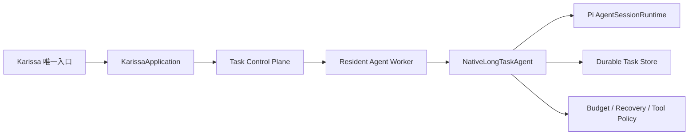

# Karissa 产品定位与原生长程 Agent 架构

- 状态：Proposed
- 日期：2026-08-12
- 目标分支：`zh/native-long-running-agent`
- 相关规范：[`TECHNICAL_SPEC.md`](./TECHNICAL_SPEC.md)、[`LONG_RUNNING_CONTROL_PLANE_SPEC.md`](./LONG_RUNNING_CONTROL_PLANE_SPEC.md)
- 决策类型：产品路线与架构重构

## 1. 决策摘要

Karissa 将从“Pi Coding Agent 加长程任务扩展”调整为“本地优先、可安全恢复、交付可验证的长程 Coding Agent”。Pi `AgentSessionRuntime` 仍是执行内核，但 Karissa 的公开产品语义由持久 Task 定义。

`Task` 是产品的顶层持久实体，`Session` 是某个 Agent 的执行记录。公开的 Karissa 入口不再创建脱离 Task 的临时 Session。长程任务所需的 checkpoint、lease、budget、recovery、continuation、tool policy 和 acceptance 必须位于原生执行路径，不能依赖可卸载的 Extension。

本次调整保留 Pi 的模型、工具、Session、compaction、Skills、用户 Extensions、TUI 和 RPC 基础能力，不重写 Agent Loop，也不建立第二套对话历史。产品首发只打通单仓库、单 Main Agent 的可靠执行路径。多 Agent、Cron、系统托管和团队控制台不进入首发承诺。

产品判断是 **Pivot**：保留 durable execution、recovery、policy 和 acceptance 内核，收缩首发范围并改写市场定位。Karissa 不以“能够运行数小时”作为差异点，而以进程级持久性、副作用安全恢复和机器可验证交付建立差异。

## 2. 产品定位与市场假设

### 2.1 目标用户

首批用户是经常处理 30 分钟到数小时 repo 级任务的资深开发者、开源维护者、小型团队技术负责人，以及需要可重复运行 Coding Agent Eval 的基础设施团队。他们通常还满足至少一个条件：代码必须留在本地，需要使用自选模型或多个 Provider，依赖企业内网、本地数据库、模拟器、专用 SDK 或特殊硬件。

Karissa 暂不面向以短时交互式 pair coding 为主的普通开发者，也不把需要 SSO、RBAC、集中管理和跨设备协作的大型企业作为第一市场。

### 2.2 用户任务

核心用户任务是：

> 当我把一个可能持续数小时的代码任务交给 Agent，我希望关闭终端后它仍然安全执行；崩溃后从明确边界恢复，不重复危险操作；最终通过预先声明的验收条件交付。

用户得到的价值是减少盯守、避免重复副作用、缩短中断后的恢复时间，并能判断任务为什么完成、为什么失败或为什么需要人工确认。

### 2.3 市场楔子

后台执行、长程目标、checkpoint、计划任务和多 Agent 已经是同类产品的常见能力。Karissa 的首发定位由三个可测试承诺组成：

1. **进程级持久性**：CLI、Worker 或模型连接中断后，Task 仍然存在，并能从 settled checkpoint 恢复。
2. **副作用安全恢复**：每个变更操作都有持久 intent。结果未知时进入 `unknown_outcome`，不自动重放。
3. **可验证交付**：完成声明必须引用真实的命令、文件、事件或 artifact，Host 验证通过后才能完成 Task。

Pi 是实现这些承诺的执行内核和生态基础，不是产品对外的首要卖点。

### 2.4 首发黄金路径

```text
karissa run "升级依赖并修复测试" --verify "npm run check"
-> 提交前检查 workspace、sandbox、预算和验收条件
-> 创建持久 Task 并启动 Worker
-> 用户可 detach，通过 status 或 attach 返回
-> Worker 崩溃后从 settled checkpoint 恢复
-> 不确定副作用暂停并请求核验
-> 执行预登记验收
-> 返回 diff、命令结果和证据
```

首发公开命令收敛为 `run`、`status`、`attach` 和 `stop`。高级 Task、Daemon 和诊断命令可以保留，但不要求普通用户理解 Task、Agent、Attempt、lease 或 fencing token。

## 3. 当前问题

当前长程任务通过多处接线进入普通 Pi Runtime：

```text
karissa <goal>
  -> handleKarissaCommand
  -> 创建 Task 并唤醒 Daemon
  -> Worker 调用 task run
  -> 修改 CLI 参数和 KARISSA_* 环境变量
  -> 进入普通 main()
  -> 加载隐藏的 karissa-long-tasks Extension
  -> attachLongTaskRuntime
```

这产生四个结构问题：

1. **入口语义分裂**：同一个 `karissa` 既可能创建持久 Task，也可能进入普通临时 Session。
2. **生命周期分裂**：Worker、CLI、环境变量、Extension 和 Runtime 分别掌握一部分执行状态。
3. **安全门禁可选**：长程 Tool Policy 通过 Extension hook 接入，结构上仍像附加功能。
4. **恢复路径隐式**：Task 和 Agent identity 通过进程环境变量传递，调用方难以从 interface 看出执行约束。

问题不在于 Extension 机制本身。用户 Extension 仍适合提供工具、资源和界面增强。问题在于持久性、安全、预算和恢复属于 Karissa 的核心语义，不应由 Extension 承担。

当前实现还有四个会直接破坏首发体验的缺口：

1. **默认执行路径不完整**：CLI 创建 Task 并报告提交成功后，Daemon 在没有 unattended sandbox capability 时会立即暂停 Task。产品必须在提交前完成 sandbox preflight，不能先报告成功再静默暂停。
2. **默认验收允许 Agent 自证完成**：一条格式合法的 evidence reference 目前就可能满足默认验收，但 Host 没有核验引用对象是否存在。首发版本必须提供 evidence resolver。
3. **时间预算没有完整执行**：`maxWallTimeMinutes` 已进入数据模型，但 Provider、工具、continuation 和 lease 续期没有统一 deadline 门禁。
4. **attach 仍是一次性快照**：当前 attach 只返回状态，不能持续消费事件、重连或 steering，尚未形成离开后再回来接管的体验。

这些问题的优先级高于删除 Extension 或增加新类。架构迁移只有同时修复首发路径，才会产生用户价值。

## 4. 产品语义

Karissa 只提供长程任务 Agent：

- `karissa <goal>`：创建、启动并附着一个持久 Task。
- `karissa`：进入 Task 创建与管理界面，不创建临时 Session。
- `karissa task ...`：查询和控制持久 Task。
- `karissa daemon ...`：管理本地 Supervisor 和 Worker。
- `--print`、JSON 和 RPC：仍是不同交互方式，但执行对象必须是 Task。
- `auth`、`config`、模型列表和包管理：保留为运行环境管理命令。

Pi 的普通 Session 能力继续作为内部执行内核和 SDK 能力存在，但不作为 Karissa CLI 的产品入口。

## 5. 总体架构



执行路径固定为：

```text
用户目标
-> 持久 Task
-> Supervisor 分配 Agent Worker
-> NativeLongTaskAgent 创建或恢复 Pi Session
-> Policy 批准每个模型请求和工具调用
-> Settled Turn 原子提交 checkpoint
-> Continuation 决定继续、等待、暂停、失败或申请完成
-> Acceptance 通过后由 Host 写入 completed
```

## 6. 模块与职责

### 6.1 KarissaApplication

`KarissaApplication` 是公开入口模块。它负责把 CLI、TUI、JSON 和 RPC 请求翻译为 Task command。

负责：

- 解析用户意图和运行模式。
- 创建、查询、附着和控制 Task。
- 连接 Supervisor。
- 展示 Task、Agent、事件和验收状态。

不负责：

- 调用模型。
- 执行工具。
- 持有完整 Session transcript。
- 直接写 Task 状态。

### 6.2 Task Control Plane

Task Control Plane 管理持久状态和执行调度。

负责：

- Task、Agent、Attempt 和 Schedule 生命周期。
- command journal、lease、fencing token 和 Worker registry。
- 启动、接管、暂停和停止 Worker。
- 事件 cursor、snapshot 和客户端重连。

不负责：

- 拼接模型上下文。
- 执行 Provider 请求。
- 执行文件或进程工具。

### 6.3 Resident Agent Worker

Resident Agent Worker 是一个 Agent 的进程所有者。

负责：

- 长期持有一个 `AgentSessionRuntime`。
- 客户端退出后继续运行。
- 管理进程组、心跳、接管凭证和私有连接。
- 将 steering、schedule tick 和 continuation prompt 投递到 Agent。
- 在退出前请求 settled checkpoint。

一个 Worker 只拥有一个 Agent。Worker 崩溃不能终止同一 Task 的其他 Agent。

### 6.4 NativeLongTaskAgent

`NativeLongTaskAgent` 是核心深模块。调用方只提供一个不可变的执行描述，模块内部负责恢复、执行、策略、持久化和收尾。

建议 interface：

```ts
interface NativeLongTaskAgent {
  run(descriptor: AgentExecutionDescriptor): Promise<AgentRunResult>;
  close(reason: AgentCloseReason): Promise<void>;
}
```

这是模块唯一的外部 seam，也是主要测试面。调用方不参与 checkpoint、重试、预算预留、工具授权和 acceptance 状态机。新增能力优先留在模块内部，只有调用方必须选择的行为才进入 descriptor。

`AgentExecutionDescriptor` 由 Task Control Plane 生成，至少包含：

- Task ID、Agent ID 和 Attempt identity。
- canonical workspace root。
- Session checkpoint reference。
- lease、execution ID 和 fencing token。
- runtime snapshot 与漂移确认。
- budget、tool policy 和 continuation policy。

它替代当前通过 `KARISSA_TASK_RUN_ID`、`KARISSA_AGENT_RUN_ID` 等环境变量拼装运行模式的方式。

### 6.5 Pi AgentSessionRuntime

Pi Runtime 继续负责：

- Provider 调用和 Agent Loop。
- Session 消息与 tree。
- 工具执行框架。
- compaction。
- Skills、Prompt、用户 Extension 和呈现模式。

Pi Runtime 不理解 Karissa 的 TaskStore、数据库 schema、lease 或 acceptance。

### 6.6 Durable Task Store

Durable Task Store 是 Task 状态的唯一持久真相，当前生产 adapter 使用 SQLite。

保存：

- Task、Agent、Attempt 和 checkpoint。
- budget reservation 和 settlement。
- durable inbox、Delegation 和 Agent message。
- Tool intent、执行结果和 unknown outcome。
- continuation decision、acceptance evidence 和 schedule。

Pi Session Store 继续保存对话历史。两者职责不同，不能建立第二套 transcript。

### 6.7 Budget / Recovery / Tool Policy

Policy 是 Host 侧确定性门禁，不依赖模型自律。

```text
模型请求工具
-> 识别工具 effect
-> 校验 Agent tool policy
-> 校验 workspace、sandbox、预算和执行权
-> await 持久化 ToolPlanned / ToolStarted
-> 允许 Pi 执行
-> await 持久化 ToolFinished
```

Policy 包含三类规则：

- **Budget Policy**：限制 Turn、时间、模型成本和并发预留。
- **Recovery Policy**：处理过期 lease、未完成工具和 unknown outcome，决定能否恢复或重试。
- **Tool Policy**：限制工具、路径、workspace mode、sandbox 和外部副作用。

任何 Policy 拒绝都必须产生持久事件。安全策略不可因 Extension 被关闭、资源重载或 UI 模式变化而绕过。

## 7. 原生生命周期 seam

Pi core 只增加通用的 Agent 生命周期 interface，不引入 Karissa 类型。建议使用一个事件入口，避免把多个回调散落到调用方：

```ts
interface AgentSessionLifecycle {
  tools(): readonly ToolDefinition[];
  handle(event: AgentLifecycleEvent): Promise<AgentLifecycleDecision>;
}
```

事件 union 覆盖：

- Turn 开始前构建持久上下文和领取 inbox。
- Provider 请求前预留预算。
- 工具执行前授权并持久化 intent。
- 工具执行后记录结果。
- compaction 前提交 checkpoint，失败时取消 compaction。
- compaction 后记录新 entry。
- settled 后提交 checkpoint 并产生 continuation decision。

两个真实 adapter 证明该 seam 的必要性：

1. 普通 Pi SDK Session 使用默认生命周期 adapter。
2. Karissa 使用 durable long-task adapter。

`karissa-long-tasks` 内置 Extension 删除。用户 Extension 继续通过原有 Extension interface 加载，但不能覆盖原生生命周期的安全决定。

工具执行前事件必须是可等待的硬门禁，不能通过忽略返回值的 Session listener 持久化。调用顺序固定为：

```text
await lifecycle.authorizeTool()
await taskStore.persistIntent()
await tool.execute()
await taskStore.persistResult()
```

任何一步失败都必须产生确定的状态转换。`persistIntent` 失败时禁止执行工具；工具结果无法持久化时记录 `unknown_outcome` 并暂停，不得按成功或失败猜测。

## 8. Policy 执行顺序

### 8.1 Provider 请求

```text
确认有效 lease
-> 检查 Task 和 Agent 状态
-> 计算最坏调用成本
-> 原子预留 budget
-> 发起 Provider 请求
-> settled 时按实际成本结算
```

预算检查同时覆盖 Turn、模型成本和 wall-time deadline。每次 Provider 请求、工具调用、continuation decision 和 lease renewal 前都检查 deadline。预算不足时不调用 Provider，Task 进入可解释的暂停状态。

### 8.2 工具调用

```text
解析工具 effect 和目标路径
-> 校验 allowed tools
-> 校验 canonical workspace
-> 校验只读或可写模式
-> 校验前台、后台和 sandbox
-> 校验外部副作用授权
-> 写入 durable intent
-> 执行工具
-> 写入结果
```

未知工具默认高风险。Bash 默认归类为 `process`，不能假设任意命令字符串安全。

### 8.3 崩溃恢复

如果存在 `ToolStarted` 但没有 `ToolFinished`：

- 可证明无副作用或幂等的操作允许恢复。
- 已记录稳定 operation ID 的操作可以查询已有结果。
- 外部副作用结果无法确认时进入 `unknown_outcome`。
- 无法证明旧 Worker 已停止时，不启动替代 Worker。

### 8.4 验收与证据

模型只能申请完成并提交 evidence reference。Host 通过对应 resolver 核验后，才允许 Task 进入 `completed`：

- `file`：文件必须存在于 canonical workspace 内，并记录内容 hash。
- `command`：引用当前 Task 的持久命令记录，包括命令、退出码和输出摘要。
- `event`：引用当前 Task 事件流中存在且类型匹配的事件。
- `artifact`：引用 Durable Task Store 中真实存在的 artifact。

没有机器可验证条件的任务进入 manual acceptance。Agent 自述、自由文本总结和无法解析的路径不能单独作为自动完成依据。

## 9. 核心不变量

1. 每个 Task 有且只有一个 Main Agent。
2. 每个 Agent 同时最多有一个有效 Worker。
3. Task 是顶层实体，Session 不能脱离 Task 成为 Karissa 的公开执行模式。
4. Worker 的 cwd、工具根和策略 workspace 来自同一个 `AgentRecord.workspaceRoot`。
5. 只有持有当前 lease、execution ID 和 fencing token 的 Worker 可以写持久状态。
6. 变更操作先持久化 intent，再产生副作用。
7. 不自动重放结果未知的副作用。
8. checkpoint 只在 settled 边界提交。
9. 模型只能申请完成，Host 通过 acceptance 后才能写 `completed`。
10. 客户端 detach 不等于停止 Worker。
11. compaction 只管理 Session 上下文，不代表 Task 完成或 Attempt 终止。
12. Extension 不能降低原生 Policy。

## 10. 迁移方案

迁移按用户价值和风险排序。每个阶段必须能够独立验证和回退，不能依赖后续阶段补齐正确性。

### 阶段零：同步上游并恢复可运行基线

- 将已抓取的 `upstream/main` 合入 `zh/native-long-running-agent`。
- 解决 Agent Harness、Session 和 Extension interface 漂移。
- 补齐生成的 Provider model data，确保全新 worktree 可以启动 CLI。
- 运行 `npm run check`、`./test.sh` 和 CLI 冒烟验证。

### 阶段一：打通首发路径

- 在创建 Task 前完成 sandbox capability preflight，并给出可执行的配置或前台降级路径。
- 实现 wall-time deadline，并在 Provider、工具、continuation 和 lease 续期前检查。
- 实现 file、command、event 和 artifact evidence resolver。
- 将 attach 从一次性 JSON 快照升级为可重连的事件流，支持 status、steering、pause 和 resume。
- 为 Worker 崩溃、Daemon 重启和 `unknown_outcome` 增加故障注入测试。

该阶段完成后，现有 Extension 架构仍可保留，但首发黄金路径必须真实可用。

### 阶段二：迁移到原生生命周期

- 增加通用 `AgentSessionLifecycle` seam。
- 实现 `NativeLongTaskAgent` 和 durable lifecycle adapter。
- 将上下文、inbox、预算、工具授权、compaction 和 settled checkpoint 从 Extension 移入原生模块。
- 将 intent 持久化改成工具执行前必须 await 的门禁。
- 删除 `karissa-long-tasks` 内置 Extension。

该阶段完成后，长程正确性不再依赖 Extension、环境变量或 listener 执行时序。

### 阶段三：收拢唯一入口

- `karissa` 默认进入 Task 创建或管理界面。
- 所有执行模式必须解析为 Task。
- 删除普通 transient CLI 路由。
- 删除 `longTasks.enabled` 和 `KARISSA_*` 模式拼装。
- 将普通用户命令收敛为 `run`、`status`、`attach` 和 `stop`。
- 更新 Karissa 独立 README、安装说明、帮助、设置、测试和 changelog。

### 阶段四：验证市场，再决定扩张

找 10 到 15 名目标用户运行至少 30 条真实 repo 任务。多 Agent、Cron、系统托管、远程控制和团队功能只有在首发指标达标后才进入产品路线。

## 11. 验证标准

### 11.1 首次体验

- 全新 checkout 到首个成功 Task 少于 10 分钟。
- `karissa run` 在提交前完成 workspace、sandbox、预算和验收检查。
- 无法后台安全执行时直接解释原因，不创建一个随后静默暂停的 Task。
- print、JSON 和 RPC 均能追溯到 Task ID 和 Agent ID。

### 11.2 生命周期与恢复

- 终端退出后 Resident Worker 继续执行。
- Worker 或 Daemon 被强制终止后，从最近 settled checkpoint 恢复。
- compaction 前 checkpoint 失败时取消 compaction 并暂停 Task。
- runtime drift 未确认时不能继续 Attempt。
- `ToolStarted` 后崩溃且结果无法确认时进入 `unknown_outcome`，不重复执行。

### 11.3 Policy 与预算

- 只读 Agent 不能写共享 workspace。
- 无真实 sandbox 时后台 Bash 默认拒绝。
- Turn、cost 或 wall-time 任一预算不足时，不发起新的 Provider 请求或工具调用。
- 过期 fencing token 的事件和 checkpoint 被拒绝。
- Extension、Skill、Prompt 和 UI 模式不能降低 Host Policy。

### 11.4 验收

- 模型调用完成工具不能直接写 `completed`。
- 自动验收失败时 Task 保持非终态。
- manual acceptance 未确认时不能完成。
- 每条 evidence reference 都能被 Host 解析并核验。
- 最终结果包含 diff、验收命令、退出码、相关 artifact 和事件引用。

### 11.5 产品指标

以下数字是 MVP 的 go/no-go 目标，不代表当前结果：

- 至少 60% 的真实任务无需人工重启即可通过预登记验收。
- 恢复场景至少 95% 回到正确 checkpoint。
- 重复高风险副作用为 0。
- 相比普通 CLI，人工盯守时间中位数下降至少 50%。
- 至少 40% 的测试用户在两周内主动运行第二个任务。

### 11.6 工程验证

每个代码阶段至少运行：

```bash
npm run check
./test.sh
```

修改测试文件时运行对应定向测试。Daemon、Worker 和恢复测试使用临时 agent directory、临时 socket 和 faux provider，不调用真实 Provider 或付费 token。

## 12. 非目标

- 不重写 Pi Agent Loop。
- 不建立第二套 Session 或 compaction。
- 不引入外部工作流引擎或远程数据库。
- 首发不实现多机 Worker、团队控制台、RBAC 或 SSO。
- 首发不宣传多 Agent、Cron、系统托管和远程控制。
- 不允许自动 push、merge、发布、部署、付款或发送外部消息。
- 不允许模型自动修改 Policy、系统 Prompt、Skill 或验收条件并立即生效。
- 不实现递归 subagent。

## 13. 风险与回滚

### 上游漂移

当前 fork 与 `upstream/main` 已存在显著提交差异。必须先同步上游，再调整核心 seam，避免基于旧 interface 扩大 fork 成本。

### Interface 过宽

如果 `AgentSessionLifecycle` 演变成大量公开回调，它会成为浅模块。实现时应坚持事件 union 和少量返回 decision，让新增生命周期行为留在 adapter 内部。

### 安全误判

任意 Bash 字符串无法被可靠静态理解。默认按高风险处理；需要更细粒度能力时使用结构化工具 adapter，而不是放宽 Bash。

### 产品范围重新膨胀

Task、Agent、Schedule、Daemon 和 RPC 已经提供了较大的技术表面，但这些能力不应自动成为首发功能。路线评审以黄金路径和产品指标为准。不能改善完成率、恢复率、盯守时间或副作用安全的功能，不进入首发范围。

### 市场差异被平台能力覆盖

“后台运行”“长程目标”和“多 Agent”容易被大型平台覆盖。产品文案和验证用例必须始终围绕进程级持久性、副作用安全恢复和可验证交付。若目标用户不愿为这些能力改变工作流，应停止扩张并重新评估产品，而不是继续增加调度和协作功能。

### 回滚

各阶段保持独立提交。阶段一只补齐现有路径，可以逐项回退。阶段二在数据库 schema 不变的前提下恢复旧 Extension 接线。阶段三回退入口路由即可恢复旧 CLI。回滚不删除 Task 数据库、Session、artifact 或 worktree。

## 14. 最终完成定义

满足以下条件后，Karissa 才算完成原生长程 Agent 转型：

1. 全新用户可以在 10 分钟内启动第一个持久 Task，失败时获得明确原因和处理方式。
2. 公开入口不会创建脱离 Task 的 Session。
3. `karissa-long-tasks` 内置 Extension 已删除。
4. 长程 Policy、checkpoint 和 continuation 位于原生必经路径。
5. Task、Agent、Attempt 和 Session identity 通过类型化 descriptor 传递。
6. Resident Worker 可以跨终端退出持续运行，并在进程或 Daemon 崩溃后安全恢复。
7. 工具 intent 必须在副作用发生前持久化，`unknown_outcome` 不自动重试。
8. Turn、cost 和 wall-time 预算均由 Host 强制执行。
9. 所有完成结果附带 Host 已核验的证据。
10. `attach` 支持重连、持续事件、状态解释和 steering。
11. 核心路径通过 faux provider、恢复、Policy、故障注入和完整仓库检查。
12. 真实用户验证达到阶段四的 go/no-go 指标，再决定是否扩展多 Agent、调度和团队能力。
