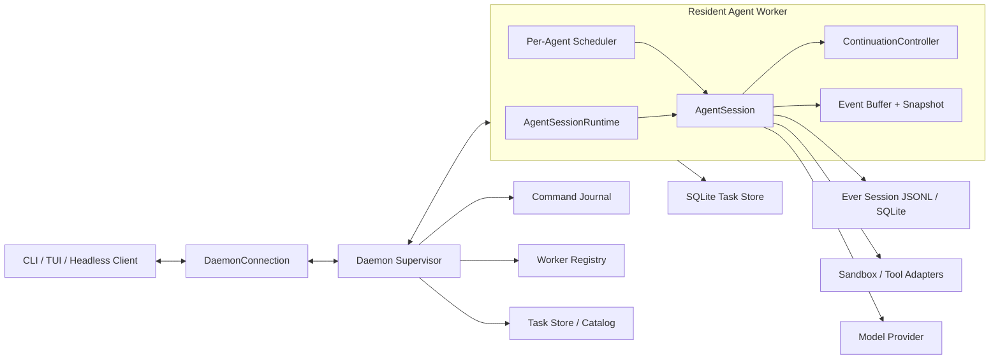

# Ever 长程控制面与自迭代运行时技术规范

- 状态：Proposed
- 版本：0.1
- 日期：2026-08-11
- 依赖规范：[TECHNICAL_SPEC.md](./TECHNICAL_SPEC.md)
- 目标读者：Ever 维护者、实现工程师、代码评审者

## 1. 决策摘要

Ever 保留现有 `Task`、`Agent`、`Attempt`、checkpoint、lease、budget、durable inbox 和 worktree 数据模型，不重写 Agent Loop，也不引入外部工作流引擎。

本规范新增一个本地长程控制面：Daemon 只负责监督、路由、恢复和调度；每个活跃 Agent 由独立的 resident worker 持有 `AgentSessionRuntime`。CLI 可以与 worker 分离并重新附着。每个 settled turn 之后，由持久化的 `ContinuationController` 决定完成、继续、等待、暂停或失败，Daemon 不再因为 Agent 未完成而无条件重复启动同一 Prompt。

该方案解决五个当前断点：

1. 隔离 worktree subagent 使用错误工作目录。
2. Daemon 只会反复启动一次性 `--print` 进程，不能附着活跃 Session。
3. 自迭代没有显式决策、质量门禁和空转保护。
4. 调度只有一次性 `nextWakeAt`，没有 Heartbeat/Cron 语义。
5. Bash 和外部副作用缺少可验证的 sandbox、幂等和恢复边界。

## 2. 与现有规范的关系

[TECHNICAL_SPEC.md](./TECHNICAL_SPEC.md) 继续定义以下内容：

- Task、Agent、Attempt、事件和 checkpoint
- lease、fencing token 和 recovery barrier
- durable inbox、Delegation 和 workspace snapshot
- budget、acceptance、runtime drift 和 compaction
- 前后台执行的产品边界

本规范只定义这些实体之上的运行控制面。冲突时遵循以下优先级：

1. 本规范对 Supervisor、worker、连接协议、continuation 和重复调度的定义优先。
2. 原规范对 Task 数据、权限、验收和副作用安全的定义优先。
3. 实际代码行为与规范冲突时，以规范为目标行为，必须通过迁移或兼容门禁显式修正，不能静默沿用。

## 3. 当前基线

当前实现已经具备：

- `@lioooooo123/ever-long-tasks` SQLite 数据面
- settled-turn 和 pre-compaction checkpoint
- Attempt runtime snapshot 和漂移门禁
- Agent lease、fencing token、过期执行恢复
- 持久消息、委派、预算预留和验收门禁
- Unix socket Daemon、一次性 Worker 和定时轮询
- read-only shared 与 isolated worktree 两种 Agent 工作区模式

当前实现仍有以下约束：

- Daemon 使用 `task.workspaceRoot` 启动所有 Agent，而不是 `agent.workspaceRoot`。
- Runtime 在解析 actor 之前校验 Task 根目录，使 isolated worktree subagent 无法使用自己的目录。
- Worker 以 `--print` 运行一个 Turn 后退出；客户端不能重连、steer 活跃 Turn 或补齐事件。
- Socket 只有单请求单响应，没有命令 ID、能力协商、事件 cursor 和 snapshot。
- `nextWakeAt` 是一次性时间点，不表达重复计划。
- 主 Agent 默认可执行 Bash，策略层无法从命令字符串推断真实文件和网络副作用。

## 4. 目标

### 4.1 运行正确性

1. 每个 Agent 必须在自己的 canonical `agent.workspaceRoot` 中运行。
2. 同一 Agent 同时最多存在一个有效执行体。
3. CLI 退出不能终止 resident worker。
4. Supervisor 退出后，活跃 worker 可以被新 Supervisor 重新接管。
5. Worker 崩溃只影响对应 Agent，不重启同一 Task 的其他 Agent。

### 4.2 可重连控制面

1. 客户端可以创建、附着、分离、steer、暂停和取消 Agent。
2. 客户端使用稳定 cursor 恢复遗漏事件。
3. 事件无法完整重放时，worker 提供一致 snapshot。
4. 变更命令使用稳定 command ID，重复请求不产生第二次副作用。
5. 慢客户端不能阻塞 worker、其他客户端或 Supervisor。

### 4.3 有界自迭代

1. 每个 settled turn 后必须产生持久 continuation decision。
2. 继续执行必须说明依据、下一步和消耗预算。
3. 连续无进展、相同失败或相同计划必须触发暂停或重新规划。
4. 完成仍由 acceptance gate 决定，模型不能直接写终态。
5. continuation 不允许越过预算、sandbox、用户确认和 unknown outcome 门禁。

### 4.4 长期调度

1. 支持单次时间、固定间隔、Cron 和事件触发。
2. 到期 Job 必须先 claim 和推进下一次时间，再投递 Prompt。
3. 崩溃后的不确定 tick 不自动重放。
4. 长时间离线产生的 missed ticks 合并为一次，不无限堆积。

### 4.5 安全与恢复

1. 无真实 sandbox 时，后台 Bash 和外部副作用默认拒绝。
2. side-effecting command 必须记录 operation ID 和恢复策略。
3. 不能验证旧进程树已结束时，不启动替代 Worker。
4. 不能确认副作用结果时进入 `unknown_outcome`。

## 5. 非目标

- 不实现模型训练、权重更新或强化学习。
- 不允许 Agent 自动修改系统 Prompt、Skill、权限或验收标准并直接生效。
- 不自动合并、推送、发布、部署、付款或发送外部消息。
- 不支持多机 Supervisor 或远程 Worker。
- 不引入 Temporal、Redis、Postgres、Kafka 或向量数据库。
- 不实现递归 subagent；Agent 拓扑继续限制为主 Agent 加一层 subagent。
- 不照搬 Prime Agent 的 IPython Kernel；Ever 继续使用 TypeScript AgentSession 和现有工具模型。
- 不承诺完全重放 token stream；重连基线是持久 snapshot 加后续事件。

## 6. 核心不变量

以下规则是实现和评审的硬门禁：

1. **Agent 工作区唯一**：Worker 的 `cwd`、工具路径根和 runtime workspace 校验都来自同一份 `AgentRecord.workspaceRoot`。
2. **执行权唯一**：只有持有当前 lease、execution ID 和 fencing token 的 Worker 可以写 Agent 事件或 checkpoint。
3. **先持久化后副作用**：变更命令和工具调用先记录 durable intent，再执行副作用。
4. **不重放不确定副作用**：已接收但没有 durable result 的变更命令返回 `uncertain`。
5. **完成由 Host 决定**：模型只能申请完成，Host 验收通过后才能写 `completed`。
6. **继续也是状态变化**：每次自动续跑都必须有持久化 decision，不能由进程退出隐式触发。
7. **Detach 不等于 Stop**：客户端生命周期和 Worker 生命周期分离。
8. **Snapshot 是恢复基线**：cursor 缺口不能用猜测补齐，必须重新应用一致 snapshot。
9. **安全策略不可降级**：sandbox 不可用时不能静默退回宿主机执行。
10. **旧 Worker 不可复活**：Supervisor generation、worker token 和 fencing token 任一过期都拒绝命令与写入。

## 7. 总体架构



### 7.1 组件职责

| 组件 | 负责 | 不负责 |
| --- | --- | --- |
| `DaemonConnection` | 客户端连接、command ID、cursor、snapshot 应用 | Provider、工具、Task 状态迁移 |
| `DaemonSupervisor` | Socket、路由、Worker 启停/接管、command journal、全局查询 | 执行 Agent Turn、Compaction、验收命令 |
| `AgentWorkerHost` | 持有一个 Agent 的 Runtime、事件、调度和 continuation | 其他 Agent 的 Session、全局 UI |
| `ContinuationController` | settled 后决策下一状态和下一 Prompt | 直接修改验收标准或权限 |
| `ScheduleEngine` | claim、推进、合并和投递 schedule tick | 执行模型和工具 |
| `TaskStore` | durable state、事务、事件和 projection | 进程通信和 UI 渲染 |
| `ExecutionPolicy` | 工具授权、sandbox 要求、副作用 metadata | 从任意 Bash 文本猜测完整效果 |

Supervisor 不得持有完整 transcript，也不得在内存中拼接历史级 snapshot。Worker 编码 snapshot，Supervisor 只做有界转发。

## 8. Agent 工作区解析

### 8.1 唯一解析接口

新增纯函数：

```ts
interface AgentExecutionContext {
  task: TaskRecord;
  agent: AgentRecord;
  canonicalWorkspaceRoot: string;
  workspaceMode: "primary" | "read_only_shared" | "isolated_worktree";
}

function resolveAgentExecutionContext(
  store: SqliteTaskStore,
  taskId: string,
  requestedAgentId?: string,
): AgentExecutionContext;
```

解析顺序固定为：

1. 读取 Task。
2. 解析 main Agent 或 `requestedAgentId`。
3. 校验 Agent 属于 Task。
4. 对 `agent.workspaceRoot` 执行 `realpath`。
5. 校验 workspace mode 与路径关系。
6. 返回唯一执行上下文。

Daemon spawn、前台 `task run`、subagent `agent run`、Runtime attach 和工具策略必须调用该接口。禁止各自重新推导工作区。

### 8.2 模式约束

| 模式 | workspace root | 写权限 |
| --- | --- | --- |
| `primary` | 等于 Task canonical root | 按主 Agent 策略 |
| `read_only_shared` | 等于 Task canonical root | sandbox 强制只读 |
| `isolated_worktree` | 位于 Ever worktree root，Git identity 匹配 Task | 仅该 worktree |

符号链接比较必须使用 `realpath` 后的路径。worktree 不存在、Git identity 不匹配或路径落在主工作区时，Agent 进入 `waiting_input`，不能退回 Task root。

## 9. Worker 生命周期

### 9.1 Worker 类型

```ts
type WorkerLifecycle = "resident" | "client_owned";
```

- `resident`：后台 Task 和普通交互 Task 使用；客户端断开后继续运行。
- `client_owned`：显式一次性 `--print`、JSON 和无持久 Session 模式使用；所有者退出后有界清理。

长程 Task 默认必须使用 `resident`。兼容期允许通过配置使用旧的一次性 Worker，但该模式不提供实时重连和活跃 Turn steering。

### 9.2 Worker Descriptor

每个活跃 Worker 在 agent directory 下保存 owner-only descriptor：

```ts
interface WorkerDescriptor {
  schemaVersion: 1;
  workerId: string;
  agentId: string;
  taskId: string;
  activeSessionId: string;
  sessionPath?: string;
  pid: number;
  processGroupId: number;
  supervisorGeneration: string;
  privateSocketPath: string;
  tokenSha256: string;
  workspaceRoot: string;
  lifecycle: WorkerLifecycle;
  startedAt: string;
  heartbeatAt: string;
}
```

原始 token 只通过启动时私有通道传递，不写入 descriptor。目录权限 `0700`，文件权限 `0600`。

### 9.3 启动协议

1. Supervisor 为 Agent 获取 launch lease。
2. 解析 `AgentExecutionContext`。
3. 创建独立进程组。
4. 生成 worker ID、execution ID、私有 token 和 generation。
5. spawn worker，`cwd` 使用 canonical Agent workspace。
6. Worker 获取 Agent lease，恢复或创建 Session。
7. Worker 写 descriptor，并通过私有通道发送 `ready` snapshot。
8. Supervisor 原子登记 Worker 后才对客户端返回成功。

步骤 5 到 8 任一步失败，Supervisor 终止该进程组、撤销 lease，并返回结构化错误。

### 9.4 Detach、Stop 与 Shutdown

- `detach`：只移除客户端 attachment。
- `stop-agent`：等待当前 Turn settled，写 checkpoint，停止对应 Worker。
- `cancel-agent`：持久化取消命令，abort 当前执行，按副作用规则恢复。
- `shutdown`：停止接受新命令，对所有 Worker 执行两阶段 checkpoint，再停止 Supervisor。
- `shutdown --force`：在 checkpoint 超时后终止进程组，并把未确认副作用转入恢复流程。

### 9.5 Supervisor 接管

Worker 每两秒检查 Supervisor 公共 socket。socket 丢失后：

1. Worker 继续当前安全执行，但暂停接收新外部命令。
2. 一个 Worker 通过原子 launch lease 启动替代 Supervisor。
3. 新 Supervisor 生成新的 generation，扫描 descriptors。
4. Worker 使用私有 token 重新认证，并提交当前 snapshot 和 event cursor。
5. Supervisor 校验 PID、进程组、Agent lease、workspace 和 token hash 后接管。
6. 无法验证的 descriptor 标记为 stale，不向其发送命令。

## 10. 本地协议

### 10.1 Framing

公共协议使用 LF 分隔 JSON。大 snapshot 使用 begin/chunk/end 记录；单 chunk 目标上限为 512 KiB。

```ts
interface CommandEnvelope<T> {
  protocolVersion: 1;
  schemaRevision: 1;
  clientId: string;
  commandId: string;
  command: string;
  target?: { taskId?: string; agentId?: string; activeSessionId?: string };
  payload: T;
  resumeCursor?: EventCursor;
}

interface EventCursor {
  generation: string;
  sequence: number;
}
```

`clientId` 在一个安装内稳定；每个用户意图生成新的 `commandId`。网络或进程重试必须复用原 ID。

### 10.2 响应

```ts
type CommandStatus = "completed" | "accepted" | "uncertain" | "rejected";

interface CommandResponse<T> {
  protocolVersion: 1;
  commandId: string;
  status: CommandStatus;
  result?: T;
  error?: {
    code: string;
    message: string;
    retryable: boolean;
  };
  cursor?: EventCursor;
}
```

`uncertain` 表示 Supervisor 已接收变更，但没有 durable result。客户端不得自动生成新 command ID 重试，必须查询原命令或请求用户决策。

### 10.3 必需命令

| 命令 | 变更性 | 目标 |
| --- | --- | --- |
| `hello` | 只读 | 协议和 capability 协商 |
| `status` | 只读 | Supervisor 和 Worker 摘要 |
| `attach` | 只读 | snapshot 加 event stream |
| `detach` | 变更 | 移除 attachment |
| `prompt` | 变更 | 向 Agent 队列投递输入 |
| `steer` | 变更 | 安全边界插入 steering |
| `pause-agent` | 变更 | settled 后暂停 |
| `cancel-agent` | 变更 | 持久取消并 abort |
| `stop-agent` | 变更 | checkpoint 后停止 Worker |
| `wake-task` | 变更 | 触发一次调度评估 |
| `shutdown` | 变更 | 协调停止所有 Worker |

### 10.4 Command Journal

新增 `daemon_commands` 表：

```sql
CREATE TABLE daemon_commands (
  client_id TEXT NOT NULL,
  command_id TEXT NOT NULL,
  command_type TEXT NOT NULL,
  target_json TEXT,
  payload_sha256 TEXT NOT NULL,
  state TEXT NOT NULL CHECK(state IN ('received', 'dispatched', 'completed', 'uncertain', 'acknowledged')),
  result_json TEXT,
  error_json TEXT,
  created_at TEXT NOT NULL,
  updated_at TEXT NOT NULL,
  PRIMARY KEY(client_id, command_id)
);
```

处理规则：

1. 同一键和相同 payload hash 返回已有状态或结果。
2. 同一键和不同 payload hash 返回 `command_conflict`。
3. `received` 在副作用 dispatch 前提交。
4. `completed` 的重复请求返回原结果。
5. `received` 或 `dispatched` 且无法证明结果时写 `uncertain`，不自动重放。
6. 客户端确认结果后写 `acknowledged`，保留至少七天再压缩。

## 11. 事件重连与 Snapshot

### 11.1 Worker Event Stream

每个 Worker generation 内的事件 sequence 从 1 单调递增。事件包括：

- Worker lifecycle
- Session state
- Assistant message start/delta/end
- Tool start/end
- Task/Agent projection 更新
- Continuation decision
- Schedule claim/delivery
- Recovery marker

Worker 保存有界内存 ring buffer，默认 10,000 条或 16 MiB，先达到者触发淘汰。Task 审计事件仍写 SQLite；ring buffer 不是恢复真相来源。

### 11.2 Attach

客户端 attach 时提交最后 cursor。Worker 返回三种结果：

- `complete_replay`：cursor 后所有事件都在 buffer。
- `partial_replay`：只能提供部分事件，随后必须应用 snapshot。
- `snapshot_required`：generation 变化或 cursor 已淘汰。

Snapshot 至少包含：

```ts
interface AgentConnectionSnapshot {
  schemaVersion: 1;
  cursor: EventCursor;
  worker: Pick<WorkerDescriptor, "workerId" | "agentId" | "taskId" | "activeSessionId" | "lifecycle">;
  task: TaskRecord;
  agent: AgentRecord;
  transcriptView: unknown;
  currentTurn?: {
    state: "queued" | "streaming" | "tool_running" | "settling";
    toolCallId?: string;
  };
  continuation?: ContinuationDecision;
  scheduleSummary: ScheduleSummary[];
}
```

客户端先原子替换 snapshot，再应用 cursor 之后的事件；旧 generation 和重复 sequence 一律丢弃。

### 11.3 Backpressure

每个 attachment 有独立的发送预算。达到上限时：

1. 停止向该 attachment 推送 delta。
2. 记录它的最后已确认 cursor。
3. 不缓存无界待发送队列。
4. socket 恢复后 replay；无法 replay 时发送新 snapshot。

## 12. ContinuationController

### 12.1 定位

`ContinuationController` 是 Host 侧确定性控制器。它不判断代码质量本身，而是依据模型结构化报告、Task 验收、预算、重复检测和运行时状态决定是否允许下一轮。

模型不拥有 continuation 状态写权限，只能通过 `task_update` 提交进度、阻塞和完成申请。

### 12.2 Decision 类型

```ts
type ContinuationAction =
  | "continue"
  | "replan"
  | "wait_user"
  | "wait_external"
  | "pause_budget"
  | "pause_no_progress"
  | "complete"
  | "fail";

interface ContinuationDecision {
  id: string;
  taskId: string;
  agentId: string;
  attemptId: string;
  settledTurnIndex: number;
  action: ContinuationAction;
  reasonCode: string;
  reason: string;
  progressFingerprint: string;
  nextPrompt?: string;
  nextWakeAt?: string;
  createdAt: string;
}
```

新增 `continuation_decisions` 表，以 `(agent_id, attempt_id, settled_turn_index)` 唯一，保证 settled 事件重放不会生成第二个决策。

### 12.3 决策顺序

每个 settled turn 按固定顺序执行：

1. lease 和 fencing token 是否仍有效。
2. 是否存在 unknown tool outcome。
3. 用户是否请求取消、暂停或 steering。
4. Task/Agent budget 是否允许下一次 provider request。
5. 是否提交完成申请；若是，运行 acceptance gate。
6. 是否显式等待用户或外部条件。
7. required Delegation 是否仍在运行或等待结果。
8. 是否达到 no-progress 或 repeated-failure 阈值。
9. 是否需要 replan。
10. 允许 `continue`，生成有界 next prompt。

前序规则命中后停止，不允许后序规则覆盖安全或预算门禁。

### 12.4 进展指纹

```text
progress_fingerprint = sha256(
  normalized completedItems
  || currentItem
  || nextActions
  || evidence refs
  || filesModified hashes
  || verification result hashes
  || child Agent states
)
```

默认策略：

- 连续 2 轮指纹相同：下一轮必须 `replan`，不得重复原 Prompt。
- 连续 3 轮指纹相同：`pause_no_progress`。
- 同一 verification 失败签名连续 2 次：`replan`。
- 同一 verification 失败签名连续 3 次：`pause_no_progress`。
- Replan Prompt 只能要求分析阻塞、改变方法或请求帮助，不能扩大权限。

阈值进入 `longTasks.continuation` 配置，默认值固定如下：

```json
{
  "maxIdenticalProgressTurns": 2,
  "pauseAfterIdenticalProgressTurns": 3,
  "maxRepeatedFailureTurns": 2,
  "pauseAfterRepeatedFailureTurns": 3,
  "maxAutomaticContinuationTurnsPerAttempt": 25
}
```

达到 Attempt 自动续跑上限后进入 `paused`，用户显式 resume 才能创建新 Attempt。

### 12.5 Next Prompt

`nextPrompt` 由 Host 模板生成，不能直接复用上一轮用户 Prompt：

```text
Continue the durable Task from the latest checkpoint.
Decision: <continue|replan>
Reason: <reason>
Current item: <current item>
Required next actions: <bounded list>
Do not repeat completed work. Re-check evidence before requesting completion.
```

Goal、acceptance、constraints 和 budget 继续由 `TaskContextBuilder` 注入，不复制进 next Prompt。

### 12.6 自迭代边界

V1 的“自迭代”只表示对同一 Task 的计划、执行、验证和重新规划循环。以下行为必须由用户批准的新功能另行设计：

- 修改系统 Prompt 或 Skill 并自动晋升
- 修改自身运行时代码后自动重启
- 从多个 Task 的结果训练策略
- 自动调整安全策略或预算

## 13. ScheduleEngine

### 13.1 Schedule 数据

新增 `schedules` 表：

```sql
CREATE TABLE schedules (
  id TEXT PRIMARY KEY,
  task_id TEXT NOT NULL REFERENCES tasks(id),
  agent_id TEXT REFERENCES agents(id),
  kind TEXT NOT NULL CHECK(kind IN ('once', 'interval', 'cron', 'event')),
  expression TEXT NOT NULL,
  timezone TEXT NOT NULL,
  payload_json TEXT NOT NULL,
  state TEXT NOT NULL CHECK(state IN ('active', 'paused', 'completed', 'cancelled')),
  next_run_at TEXT,
  last_claim_id TEXT,
  last_claimed_at TEXT,
  last_delivered_at TEXT,
  created_at TEXT NOT NULL,
  updated_at TEXT NOT NULL
);
```

Cron 表达式使用五段标准格式，timezone 必须是 IANA 名称。Phase D 使用固定精确版本的 `croner@10.0.1` 计算下一次触发时间；只使用其解析能力，不使用其内存定时器作为持久调度真相。

### 13.2 Claim-before-delivery

到期时在一个事务内：

1. 校验 schedule 仍 active。
2. 生成 claim ID。
3. 计算并写入下一次 `next_run_at`；once 直接写 completed。
4. 写 `ScheduleClaimed` 事件。
5. 提交事务。
6. 将带 claim ID 的 Prompt 投递给 Worker。
7. Worker 接受后写 `ScheduleDelivered`。

步骤 5 后崩溃而步骤 6 未确认时，该 tick 标记为 interrupted，不自动重放；未来 tick 正常运行。

### 13.3 Missed Tick

- `interval` 和 `cron` 离线期间最多合并为一个 tick。
- 合并 Prompt 携带错过次数和时间范围。
- 不允许生成与离线时长成比例的 backlog。
- Agent 正忙时只保留一个 pending coalesced tick。

### 13.4 Heartbeat

Heartbeat 是 interval schedule 的产品别名，不新增第二套调度器。Heartbeat Prompt 必须包含：

- 当前 Goal 和最新 checkpoint 摘要
- pending inbox 和外部信号摘要
- 上次 heartbeat 决策
- 本次允许的最大 Turn 和成本

没有待办、信号或可执行 next action 时，Heartbeat 写 `no_action`，不调用 Provider。

## 14. 工具安全与副作用协议

### 14.1 Sandbox 门禁

后台执行以下工具时必须存在可验证 sandbox：

- `bash`
- 任意可创建子进程的扩展工具
- 任意 `reconcilable_write`
- 任意 `external_side_effect`

`unattendedApproved` 只表示用户同意后台运行，不等于 sandbox 可用，也不能关闭工具级授权。

没有 sandbox 时允许的后台工具仅限经过注册的纯读取 adapter。`--unsafe-no-sandbox` 保留为显式单次诊断能力，但：

- 不写入 Task 默认值
- 不被 schedule 或 heartbeat 继承
- 每个 Turn 前重复显示和记录 unsafe 状态
- 禁止外部发布、推送、付款和消息发送类工具

### 14.2 工具 Metadata

所有工具必须在注册时声明：

```ts
interface ToolDurabilityMetadata {
  effect: "read_only" | "reconcilable_write" | "process" | "external_side_effect";
  supportsIdempotencyKey: boolean;
  requiresSandbox: boolean;
  reconcileStrategy: "retry" | "file_hash" | "adapter" | "manual";
}
```

缺少 metadata 的扩展工具按 `external_side_effect + requiresSandbox + manual` 处理。

通用 Bash 始终视为 `process`。路径白名单不能证明 Bash 安全，真正边界由 sandbox mount、network policy 和进程权限提供。

### 14.3 Operation Record

工具执行记录增加稳定 operation ID、process group ID、sandbox ID 和 idempotency key。Worker 崩溃后：

| Effect | 恢复行为 |
| --- | --- |
| read-only | 相同 operation ID 可重试 |
| reconcilable write | 比对目标 hash，一致则补记完成，否则等待用户 |
| process | 先终止并验证进程组，再判断输出和工作区 |
| external side effect | adapter reconcile；没有 adapter 时 `unknown_outcome` |

只通过 PID 判断存活不足以完成 recovery barrier。必须同时验证进程组、启动时间或 sandbox identity，避免 PID 复用。

## 15. Runtime Snapshot

现有 RuntimeSnapshot 增加真实内容 hash：

- Context file canonical path 和内容 hash
- 启用 Skill 的 identity、版本和入口文件 hash
- Extension 包 identity、版本和入口 bundle hash
- 工具 metadata 和 schema hash
- System Prompt hash
- Sandbox image/profile/mount/network policy hash
- Ever build version和 upstream commit

环境变量只记录允许列表中的变量名及“是否存在”，不记录值。Provider token、Cookie、Authorization header 和完整 shell 环境不能进入 snapshot。

Snapshot 变化分类：

| 变化 | 行为 |
| --- | --- |
| UI 主题、颜色、客户端尺寸 | 兼容 |
| 日志级别 | 兼容 |
| Model、Prompt、Skill、Extension、工具 schema | 等待用户接受 drift |
| Sandbox、权限、workspace identity | 不允许在原 Attempt 继续 |
| 协议主版本 | 拒绝恢复，要求升级或回滚 |

## 16. CLI 与配置

### 16.1 CLI

保留现有命令，并增加：

```text
ever attach <task-id> [--agent <agent-id>]
ever detach <task-id> [--agent <agent-id>]
ever task stop <task-id> [--agent <agent-id>]
ever task schedule add <task-id> --cron <expr> --timezone <iana>
ever task schedule add <task-id> --interval <duration>
ever task schedule ls <task-id>
ever task schedule pause|resume|cancel <schedule-id>
ever daemon shutdown [--force]
ever daemon workers
```

`task logs --follow` 迁移到 attach event stream；保留 SQLite 审计日志模式 `task events`。

### 16.2 配置

```json
{
  "longTasks": {
    "workerMode": "resident",
    "maxConcurrentTasks": 1,
    "maxConcurrentAgentsPerTask": 4,
    "workerHeartbeatSeconds": 5,
    "workerLeaseSeconds": 30,
    "eventReplayMaxCount": 10000,
    "eventReplayMaxBytes": 16777216,
    "snapshotChunkBytes": 524288,
    "commandJournalRetentionDays": 7,
    "continuation": {
      "maxIdenticalProgressTurns": 2,
      "pauseAfterIdenticalProgressTurns": 3,
      "maxRepeatedFailureTurns": 2,
      "pauseAfterRepeatedFailureTurns": 3,
      "maxAutomaticContinuationTurnsPerAttempt": 25
    },
    "unattendedMode": "require-sandbox"
  }
}
```

兼容窗口只保留一个发布周期：`workerMode = "one_shot"` 可回退旧路径，但 UI 必须标记“不支持实时重连”。下一个发布周期删除该配置，不长期维护双实现。

## 17. 故障语义

| 故障 | 必须行为 |
| --- | --- |
| CLI 崩溃或断网 | Worker 继续；重连后 replay 或 snapshot |
| Supervisor 崩溃 | Worker 保持安全执行；新 Supervisor 接管 |
| Worker 崩溃 | 对应 Agent 进入 recovery；其他 Agent 不受影响 |
| Worker 无法终止 | Agent 保持 recovering/unknown_outcome，不启动替代执行 |
| Socket 响应丢失 | 客户端用原 command ID 查询，不生成新变更命令 |
| Event cursor 缺口 | 应用一致 snapshot，不拼接猜测状态 |
| Snapshot 中断 | 丢弃未完成 snapshot，从 begin 重新请求 |
| Provider 临时失败 | 按现有退避；达到上限等待外部条件 |
| Provider 调用结果未知 | 不结算为成功；保留预算 reservation 并进入恢复 |
| Continuation 空转 | replan，随后 pause_no_progress |
| Schedule 投递结果未知 | 不重放当前 tick，推进未来 tick |
| Sandbox 启动失败 | 保持 queued/paused，不在宿主机执行 |
| Runtime drift | 按变化分类等待接受或拒绝恢复 |
| Worktree 丢失 | 对应 subagent 等待输入，不退回主工作区 |

## 18. 可观测性

`daemon status` 和 `task show` 至少显示：

- Supervisor PID、generation、启动时间和协议版本
- 每个 Worker 的 PID、进程组、Agent、workspace、Session 和最后 heartbeat
- 每个 attachment 的 client ID、最后确认 cursor 和 backpressure 状态
- 当前 Turn、工具、lease 和 fencing token 摘要
- 最近 continuation decision 和无进展计数
- 每个 schedule 的下次执行、最近 claim 和 delivery 状态
- sandbox identity 和 policy hash
- command journal 中未完成或 uncertain 的命令数量

日志分为三类：

1. SQLite Task audit event：恢复真相。
2. Worker structured log：进程诊断。
3. Client event stream：UI 状态，不作为恢复来源。

所有日志使用稳定 `type`、`schemaVersion`、`taskId`、`agentId`、`workerId` 和 correlation ID。凭据与完整环境变量必须清理。

## 19. 数据迁移

新增单向 migration `004_control_plane`：

- `daemon_commands`
- `continuation_decisions`
- `schedules`
- Worker descriptor 不进入 SQLite，保存在运行目录

迁移不得重写已有 Task、Agent、Attempt 或事件。升级后：

- 非终态 Task 保持原状态。
- 没有 continuation decision 的旧 checkpoint 在首次恢复时创建 `legacy_resume` decision。
- 旧 `nextWakeAt` 转换成一个 `once` schedule；转换成功后保留原字段一个发布周期供回滚读取。
- 旧 Daemon 必须先停止；不能与新协议 Supervisor 并行写同一数据库。

降级时旧版本忽略新表，读取保留的 `nextWakeAt`。新版本生成的 resident Worker 必须全部停止后才能降级。

## 20. 测试策略

### 20.1 单元测试

- Agent execution context 对三种 workspace mode 的解析
- symlink、丢失 worktree 和错误 Agent/Task 归属
- command journal 重放、冲突和 uncertain
- cursor generation、sequence 去重和 snapshot 替换
- continuation 决策优先级
- progress fingerprint 稳定性
- identical progress 和 repeated failure 阈值
- schedule 下一次时间、时区和 missed tick 合并
- RuntimeSnapshot 内容 hash 和 drift 分类
- Tool metadata 默认降级为最高风险

### 20.2 进程集成测试

- resident Worker 启动、detach、attach 和正常 stop
- CLI 在 assistant streaming 中崩溃，Worker 继续并可重连
- Supervisor `kill -9` 后由 Worker 拉起并接管
- Worker `kill -9` 后只恢复对应 Agent
- 旧 Worker `SIGSTOP` 超过 lease 后，新 Worker 被 recovery barrier 阻止
- 相同 command ID 重发只产生一次 Prompt、steering 或 cancellation
- Socket 在命令落库后、dispatch 前和 result 返回前分别崩溃
- 慢客户端触发 backpressure，其他客户端仍正常接收
- event buffer 淘汰后通过 snapshot 恢复
- 大 snapshot 分块中断后重新获取
- 进程组中的子 Bash 被 recovery 完整终止

### 20.3 长程任务集成测试

- 主 Agent 连续 20 Turn、中途 compaction、detach 和重新 attach
- 主 Agent 同时委派两个只读 subagent 和一个 isolated worktree subagent
- isolated worktree subagent 的 `cwd`、写入和 checkpoint 均指向其 worktree
- 主 Agent 崩溃期间 subagent 继续运行并持久化 report
- inbox 在注入后、checkpoint 前崩溃时重新投递但不重复副作用
- 连续无进展触发一次 replan，第三次暂停
- acceptance 失败时继续或 replan，不能完成 Task
- required subagent 未完成时不能完成主 Task
- unknown tool outcome 阻止 continuation
- budget reservation 失败时不发起下一次 Provider 请求

### 20.4 Schedule 测试

- once、interval、Cron 和 event schedule
- 夏令时跳变和 IANA timezone
- claim 提交后、Prompt 投递前崩溃时当前 tick 不重放
- Daemon 离线一小时后 missed ticks 合并一次
- Agent 忙时多个 heartbeat 合并一次
- 无 action heartbeat 不调用 Provider

### 20.5 安全测试

- 无 sandbox 时后台 Bash、write 和扩展副作用被拒绝
- `unattendedApproved` 不能绕过 sandbox
- read-only Agent 的重定向、子进程、symlink 和自定义扩展写入失败
- isolated Agent 无法写主工作区或其他 worktree
- Worker descriptor、socket 和 journal 权限正确
- 伪造 Worker token、旧 Supervisor generation 和过期 fencing token 被拒绝
- 日志和 snapshot 不包含 provider token 或环境变量值

## 21. 发布验收

### 21.1 功能验收

发布前必须完成一条真实任务：

1. 运行不少于 20 个 Turn。
2. 触发至少一次 compaction。
3. 在 streaming 中关闭客户端并重新 attach。
4. `kill -9` Supervisor，确认 Worker 被新 Supervisor 接管。
5. `kill -9` 一个 subagent，确认其他 Agent 继续运行。
6. 使用 isolated worktree subagent 完成一次代码修改并返回验证证据。
7. 触发一次 replan 和一次 schedule tick。
8. 最终通过创建 Task 时登记的 acceptance。
9. 全程不重复外部副作用，不跨工作区写入。

### 21.2 稳定性验收

- Daemon 连续运行 8 小时。
- 期间至少 50 次 attach/detach。
- 至少模拟 10 次 Provider 临时错误。
- 至少模拟 5 次 Worker 崩溃和 3 次 Supervisor 崩溃。
- 结束后 SQLite integrity check 通过，无非终态 command journal 悬挂且无双 Worker。

### 21.3 性能门槛

- 本地 attach 到首个 snapshot chunk：P95 小于 300 ms，不含首次 Session 文件读取。
- cursor 可 replay 时恢复到最新状态：P95 小于 200 ms。
- Supervisor 转发单个事件只序列化一次。
- 慢客户端不能让 Worker provider loop 停顿超过 50 ms。
- 100 个 inactive Task 不启动 Worker。
- 4 个并行 Agent 下 Supervisor RSS 不随 transcript 总长度线性增长。

## 22. 独立交付阶段

该改动预计涉及超过 8 个文件，并新增 Supervisor/Worker 私有通信组件。必须按以下阶段独立合并；每个阶段结束后系统都可使用，不依赖下一阶段才能成立。

### Phase A：执行正确性与安全门禁

范围：

- `resolveAgentExecutionContext`
- Daemon、前台 Runtime 和 subagent 统一使用 `agent.workspaceRoot`
- isolated worktree 真实运行集成测试
- `unattendedApproved` 与 sandbox 可用性分离
- Tool metadata 默认风险策略
- PID 加进程组或 sandbox identity 的 recovery 校验

完成定义：现有一次性 Worker 路径正确、安全、可恢复。即使后续阶段不实现，也能可靠运行 Phase 1/2 长程任务。

主要文件：

- `packages/long-tasks/src/execution-context.ts`
- `packages/long-tasks/src/execution-policy.ts`
- `packages/long-tasks/src/recovery.ts`
- `packages/coding-agent/src/core/long-task-runtime.ts`
- `packages/coding-agent/src/cli/daemon-command.ts`
- 对应定向测试

### Phase B：Resident Worker 与可重连协议

范围：

- `DaemonConnection`
- Supervisor、WorkerHost、descriptor 和 private transport
- command journal
- attach、event cursor、snapshot 和 backpressure
- worker process group、接管和两阶段 shutdown
- `004_control_plane` 中 `daemon_commands`
- one-shot 兼容模式

完成定义：客户端退出不终止 Agent；Supervisor 和客户端崩溃后可以恢复，不重复变更命令。即使没有自迭代，用户也能把 Ever 当作可附着的长期 Session 使用。

建议模块：

```text
packages/coding-agent/src/daemon/
  connection.ts
  protocol.ts
  supervisor.ts
  worker-host.ts
  worker-registry.ts
  snapshots.ts
  command-journal.ts
```

### Phase C：有界 Continuation

范围：

- `ContinuationController`
- continuation decision schema 和 migration
- progress fingerprint、replan、no-progress pause
- Host 生成 next Prompt
- budget、acceptance、Delegation 和 unknown outcome 门禁
- CLI/TUI 显示 continuation reason

完成定义：Agent 可以在无人逐轮输入时持续推进，但每一轮继续都有可审计原因，并能在无进展时自行停止。

### Phase D：重复调度与系统托管

范围：

- once、interval、Cron、event schedule
- claim-before-delivery、missed tick 合并和 Heartbeat
- launchd/systemd 的安装、启动、停止、升级和 doctor
- 8 小时稳定性验收

完成定义：Ever 能在用户终端关闭和机器重启后恢复计划工作，不重复不确定 tick。

## 23. 实现与验证命令

实现时不得运行仓库禁止的 `npm test` 或 `npm run build`。每个阶段使用：

```bash
npm run check
(cd packages/long-tasks && node "../../node_modules/vitest/dist/cli.js" --run test/execution-context.test.ts)
(cd packages/long-tasks && node "../../node_modules/vitest/dist/cli.js" --run test/continuation-controller.test.ts)
(cd packages/long-tasks && node "../../node_modules/vitest/dist/cli.js" --run test/schedule-engine.test.ts)
(cd packages/coding-agent && node "../../node_modules/vitest/dist/cli.js" --run test/daemon-supervisor-process.test.ts)
./scripts/test.sh
```

只在修改对应测试文件时运行其定向测试并迭代至通过。Daemon 进程测试必须使用临时 agent directory、临时 socket 和 faux provider，不使用真实 API、密钥或付费 token。

## 24. 回滚

### Phase A

通过回退代码恢复旧一次性 Worker。数据库不变。

### Phase B

1. 停止所有 resident Worker。
2. 设置 `workerMode = "one_shot"`。
3. 停止新 Supervisor。
4. 回退二进制。
5. 保留 `daemon_commands`，旧版本忽略该表。

### Phase C

关闭自动 continuation 后，Task 保持可人工 `task run`。已有 decisions 作为审计记录保留。

### Phase D

暂停 schedules，停止并卸载 launchd/systemd user service。Task、checkpoint 和原 `nextWakeAt` 不删除。

回滚不得删除数据库、Session、artifacts、worktree 或用户代码。

## 25. 方案取舍

### 25.1 采用 Resident Worker，而不是继续重复启动一次性 CLI

一次性 Worker 实现简单，但无法提供活跃 Turn steering、实时重连、完整进程树所有权和 Supervisor 接管。继续在其上叠加轮询会让 Session 生命周期、命令幂等和恢复语义分散在 CLI、Daemon 和 Store 中。

Resident Worker 把一个 Agent 的 Runtime、调度、事件和子进程放回同一所有权边界。Supervisor 只协调，不执行 Provider 或工具，故障域更清晰。

### 25.2 不引入 Temporal

当前目标是单机、本地 SQLite、最多一个并行 Task 和四个 Agent。Temporal 会引入独立服务、第二套状态真相、部署和版本兼容成本。只有出现多机 Worker、跨设备接管或高规模调度需求时才重新评估。

### 25.3 不采用“模型自行决定无限继续”

模型可以提出下一步，但不能拥有预算、安全和终态写权限。确定性的 ContinuationController 能提供可审计、可测试和可停止的自迭代边界。

## 26. 最脆弱假设

本方案假设 `AgentSessionRuntime` 可以在独立 Worker 中长期存活，并能在 settled 边界生成一致 snapshot。如果该假设不成立，live attach 只能退化为 transcript snapshot，活跃 Turn steering 将不可用。

为避免该假设击穿数据设计：

- command journal、continuation decision、schedule 和 Task checkpoint 均不依赖 resident 内存。
- `WorkerHost` 通过 adapter 驱动 Runtime，允许回退到 one-shot adapter。
- one-shot adapter 仍必须遵循 Agent workspace、command ID、continuation 和副作用规则。
- 只有实时 delta、活跃 Turn steering 和 Supervisor 接管属于 resident 专属能力。

## 27. 外部依赖

默认不新增外部服务、账号、API key 或语言运行时。

- 进程、socket 和文件权限使用 Node.js 内建模块。
- 持久状态继续使用现有 SQLite adapter。
- 测试继续使用 Vitest 和 faux provider。
- Phase D 新增直接依赖 `croner@10.0.1`。它没有传递依赖，支持 IANA timezone；安装时仍须按仓库规则审查包内容、许可、lockfile 和 shrinkwrap diff。
- 本规范不新增 sandbox 产品或云服务。Phase A 只接入 Ever 运行时提供的 `SandboxCapability`；能力不存在时，后台副作用工具按第 14 节拒绝执行。独立 sandbox 实现属于另一份安全规范，不能阻塞本规范的 fail-closed 门禁。

## 28. 参考实现

- [Prime Agent Architecture](https://github.com/PrimeIntellect-ai/prime-agent/blob/main/packages/coding-agent/docs/architecture.md)：客户端、Supervisor、resident worker 和 Session 的所有权边界。
- [Prime Agent Daemon Architecture](https://github.com/PrimeIntellect-ai/prime-agent/blob/main/packages/coding-agent/docs/daemon.md)：worker 接管、command journal、cursor、snapshot、backpressure 和调度 claim。
- [Prime Agent Long-Running Agents](https://github.com/PrimeIntellect-ai/prime-agent/blob/main/packages/coding-agent/docs/long-running-agents.md)：Goal、Autonomous、Heartbeat、Cron 和 detached Session 的统一执行路径。
- [TECHNICAL_SPEC.md](./TECHNICAL_SPEC.md)：Ever 已确定的持久任务、多 Agent、预算和安全边界。

## 29. 批准条件

本规范批准即代表同意以下方向：

1. 先修复 Agent workspace 和安全正确性，再建设 Resident Worker。
2. 自迭代采用持久化、确定性的 ContinuationController。
3. Supervisor 不执行 Provider、工具或 Compaction。
4. 重复调度采用 claim-before-delivery，不重放不确定 tick。
5. 不引入外部工作流服务或第二语言运行时。
6. Phase A 至 D 独立实现、验证和合并。

批准本规范不授权自动提交、推送、发布或部署。
