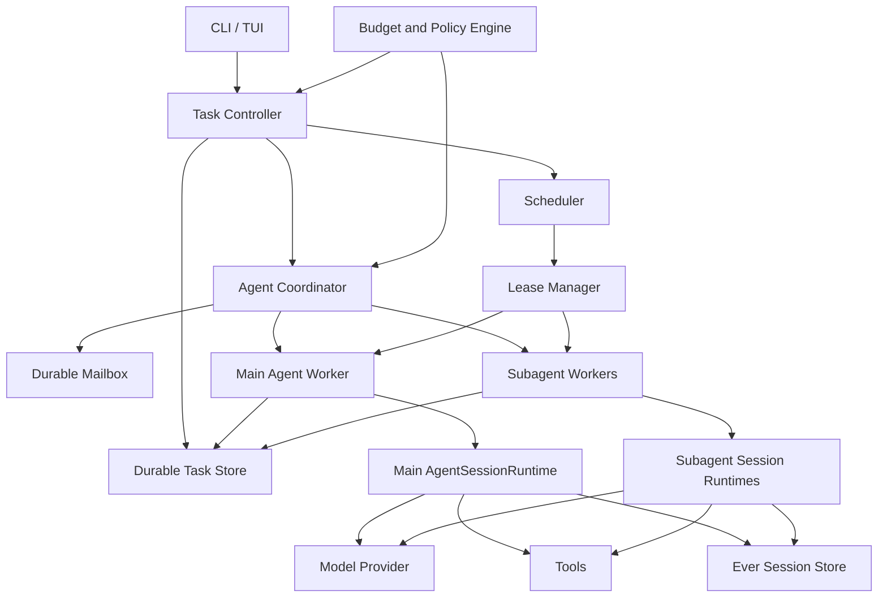

# Ever 原生长程任务与多 Agent 运行时技术规范

- 状态：Draft
- 版本：0.5
- 日期：2026-08-10
- 目标仓库：[`Lioooooo123/Ever`](https://github.com/Lioooooo123/Ever)
- 目标读者：Ever 维护者、实现工程师、代码评审者

## 1. 摘要

Ever 基于上游 Ever Agent Harness 的 MIT 许可代码演进。主要能力放在独立模块中，只对现有 core 增加必要的通用接口。首个核心改动是在现有 Agent Session、工具系统、compaction 和 provider 之上增加持久任务运行时，使一个任务可以跨会话、跨上下文压缩、跨进程退出继续执行。

长程任务在本规范中指持续数小时或数天、允许等待外部条件、能够在失败后恢复的工作。扩大上下文窗口不能满足这些要求。运行时需要保存目标、验收条件、执行历史、checkpoint、预算、等待条件和副作用状态，并在每次恢复前判断哪些操作可以重试。

V1 保留 Ever 现有的会话格式和 Agent Loop，不实现新的对话系统，也不把完整执行历史反复放进模型上下文。一个 Task 可以拥有一个主 Agent 和多个 subagent。每个 Agent 使用独立 session，通过持久 inbox 交换指令、问题、进度和结果。

## 2. 背景

Ever 从上游 Ever 继承了以下基础能力：

- `AgentSessionRuntime` 和 `AgentSession`
- JSONL 或 SQLite session 持久化
- session tree、`/tree` 和 `/compact`
- `session_before_compact`、`context`、`agent_settled`、工具执行事件等扩展接口
- RPC、Server、Protocol 和 SQLite session backend
- 可替换工具、provider、TUI 和资源加载器

这些能力能保存对话，却没有独立于对话的长期任务实体。进程中断后，系统也缺少统一的 lease、预算、等待条件和副作用恢复规则。

Ever 默认继承启动用户的文件、进程、网络和凭据权限。无人值守执行会放大这一风险，因此 V1 不允许在没有 sandbox 的情况下静默转入后台。

## 3. 目标

V1 必须满足以下目标：

1. 用户可以创建带验收条件的持久任务。
2. 一个任务可以关联多个执行 attempt 和多个 Ever session。
3. 每个 settled turn 后生成原子 checkpoint。
4. Ever 退出、worker 崩溃或机器重启后，任务可以从最近的安全边界恢复。
5. 结果未知的副作用不得自动重放。
6. compaction 不得丢失任务目标、验收条件、预算和当前进度。
7. 用户可以查看、暂停、恢复和取消任务。
8. 后台执行必须受到时间、Turn 数、成本和权限策略约束。
9. 模型不能直接修改持久任务状态。
10. 任务只有在验收条件通过后才能进入 `completed`。
11. 主 Agent 可以创建、暂停、恢复和取消多个 subagent。
12. 每个 subagent 拥有独立 session、checkpoint、lease、预算和工具策略。
13. 主 Agent 与 subagent 之间的消息在进程重启后仍可投递。
14. subagent 的结果必须带有证据引用，主 Agent 不能只依赖自然语言结论完成 Task。

## 4. 非目标

V1 不包含以下内容：

- 无限自治
- 多机调度
- 跨 Task 的 Agent 通信
- 任意 Agent 广播和 subagent 递归委派
- 多个 Agent 并发写入同一个工作区
- 云端控制台
- 向量数据库和通用知识库
- 自动发布、自动合并、自动付款和自动对外发消息
- Windows 开机自启动
- 完整重放 LLM token stream
- 对未知外部副作用进行自动补偿
- 重写 Ever session tree 或 compaction 格式

## 5. 术语

| 术语 | 含义 |
| --- | --- |
| Task | 持久目标，包含验收条件、预算和工作区绑定信息 |
| Attempt | Task 的一次连续执行，受 Turn 数和时间上限约束 |
| Session | Ever 原生对话和工具调用历史 |
| Turn | 一次用户或运行时输入触发的 Agent Loop |
| Settled turn | 不再有自动重试、compaction 或排队消息的 Turn 边界 |
| Checkpoint | 最近安全状态的结构化快照 |
| Event | Task 生命周期中的追加式记录 |
| Lease | worker 对 Task 的有期限执行权 |
| Wake condition | 允许等待中的 Task 再次进入队列的条件 |
| Unknown outcome | 操作已经开始，但运行时无法确认结果是否生效 |
| Agent | Task 内持久化的执行者，拥有独立 session、checkpoint 和预算 |
| Main agent | Task 唯一的主 Agent，负责拆解、委派、汇总和申请完成 |
| Subagent | 由主 Agent 直接创建的受限 Agent，V1 不能继续委派 |
| Delegation | 主 Agent 分配给 subagent 的目标、范围、验收条件和预算 |
| Inbox | Agent 的持久入站消息队列 |
| Agent message | 带发送者、接收者、顺序号和去重标识的持久消息 |

## 6. 总体架构



### 6.1 模块边界

新增 workspace package：`packages/long-tasks`，包名为 `@lioooooo123/ever-long-tasks`。该包由 Ever monorepo 统一管理。

模块职责如下：

| 模块 | 职责 |
| --- | --- |
| `TaskStore` | 数据迁移、事务、Task 查询、事件追加、checkpoint 和 lease |
| `TaskController` | 校验命令、执行状态迁移、调用策略和调度器 |
| `TaskScheduler` | 查找可运行 Task、处理等待条件和退避时间 |
| `AgentWorker` | 创建或恢复某个 Agent 的 Ever session，驱动一次 attempt |
| `RecoveryEngine` | 检查未完成工具调用和未知副作用，决定恢复方式 |
| `TaskContextBuilder` | 构建每次 LLM 调用需要的持久任务上下文 |
| `BudgetPolicy` | Turn、时间、成本和错误次数限制 |
| `ExecutionPolicy` | 前台、后台、sandbox 和工具风险策略 |
| `AgentCoordinator` | 管理 Agent 树、委派、消息投递、授权和聚合状态 |
| `WorkspaceAllocator` | 为只读 Agent 分配共享视图，为写 Agent 分配隔离 worktree |

`AgentCoordinator` 是一个深模块。调用方不需要理解消息顺序、重复投递、父子授权和 checkpoint 确认的实现。它只暴露以下 interface：

```ts
interface AgentCoordinator {
  coordinate(actor: AgentIdentity, command: CoordinationCommand): Promise<CoordinationResult>;
  claimInbox(agentId: string, lease: AgentLease, limit: number): Promise<InboxBatch>;
  commitCheckpoint(input: AgentCheckpointCommit): Promise<void>;
}
```

生产实现使用 SQLite adapter，测试使用内存 adapter。消息授权、排序、去重和状态迁移必须通过同一 interface 验证，测试不得绕过该 seam 直接断言数据库内部状态。

### 6.2 与 Ever core 的集成点

实现阶段允许修改以下位置：

- `packages/coding-agent/src/core/agent-session-runtime.ts`
- `packages/coding-agent/src/core/agent-session.ts`
- `packages/coding-agent/src/core/session-manager.ts`
- `packages/coding-agent/src/core/extensions/types.ts`
- `packages/coding-agent/src/cli/`
- `packages/coding-agent/src/cli.ts`
- `packages/coding-agent/src/main.ts`

对 Ever core 的新增接口必须保持通用，不得包含长程任务数据库类型。计划增加两个能力：

```ts
interface AgentSessionRuntime {
  createCheckpoint(): Promise<SessionCheckpoint>;
  restoreCheckpoint(checkpoint: SessionCheckpoint): Promise<void>;
}

interface SessionCheckpoint {
  sessionId: string;
  sessionPath?: string;
  leafEntryId?: string;
  settledTurnIndex: number;
  runtimeSnapshotSha256: string;
  createdAt: string;
}

interface RuntimeSnapshot {
  everVersion: string;
  upstreamCommit: string;
  protocolVersion: number;
  model: {
    provider: string;
    id: string;
    thinkingLevel?: string;
  };
  systemPromptSha256: string;
  contextFiles: Array<{
    path: string;
    sha256: string;
  }>;
  resources: Array<{
    kind: "skill" | "extension" | "prompt" | "tool";
    identity: string;
    version?: string;
    sha256: string;
  }>;
  toolPolicySha256: string;
  sandboxPolicySha256: string;
}
```

`createCheckpoint()` 只能在 settled 边界成功。流式输出、工具执行或自动 compaction 进行中时调用必须返回带类型的错误。

`RuntimeSnapshot` 是恢复正确性的一部分，不是可选诊断信息。它在 Attempt 开始时固化，每个 checkpoint 保存其 hash。快照只记录标识、版本和内容 hash，不记录 provider token、环境变量值或其他凭据。

恢复时先重建当前快照并比对。仅 UI 主题等不影响执行语义的变化可直接继续。provider、model、system prompt、context file、工具集、扩展、权限策略、sandbox 策略或协议版本不一致时，Agent 进入 `waiting_input`，记录 `RuntimeDriftDetected`。只有用户执行 `ever task resume <task-id> --accept-runtime-drift` 后才可创建新 Attempt，并记录 `RuntimeDriftAccepted` 及新旧快照 hash。

## 7. 持久状态模型

### 7.1 存储位置

默认数据库：

```text
~/.ever/agent/long-tasks.sqlite
```

任务附件和大体积证据：

```text
~/.ever/agent/tasks/<task-id>/artifacts/
```

数据库和 artifacts 必须使用 `0700` 目录权限。数据库文件应使用 `0600`。敏感环境变量、provider token 和完整 shell 环境不得写入事件或 checkpoint。

### 7.2 SQLite 配置

连接建立后执行：

```sql
PRAGMA journal_mode = WAL;
PRAGMA foreign_keys = ON;
PRAGMA busy_timeout = 5000;
PRAGMA synchronous = NORMAL;
```

所有 schema 变化使用单向、带版本号的 migration。启动时发现数据库 schema 高于当前程序版本，程序必须拒绝写入并给出升级提示。

### 7.3 表结构

下列 SQL 是 V1 的最终状态，不表示 Phase 1 一次开启全部功能。`001_long_tasks` 创建 `tasks`、`agents`、`attempts`、`task_events`、`checkpoints`、`leases`、`wake_conditions` 和 `budget_reservations`；Phase 1 只允许 `agents.kind = 'main'`，每个 Task 在创建事务中同时创建唯一主 Agent。`002_multi_agent` 创建 `delegations`、`agent_messages` 及相关索引，然后开启 subagent 和父子通信。

```sql
CREATE TABLE tasks (
  id TEXT PRIMARY KEY,
  title TEXT NOT NULL,
  goal TEXT NOT NULL,
  acceptance_json TEXT NOT NULL,
  constraints_json TEXT NOT NULL,
  state TEXT NOT NULL,
  state_reason TEXT,
  workspace_root TEXT NOT NULL,
  workspace_fingerprint TEXT NOT NULL,
  initial_git_head TEXT,
  total_turns INTEGER NOT NULL DEFAULT 0,
  total_cost_usd REAL NOT NULL DEFAULT 0,
  next_wake_at TEXT,
  created_at TEXT NOT NULL,
  updated_at TEXT NOT NULL,
  completed_at TEXT
);

CREATE TABLE agents (
  id TEXT PRIMARY KEY,
  task_id TEXT NOT NULL REFERENCES tasks(id),
  parent_agent_id TEXT REFERENCES agents(id),
  kind TEXT NOT NULL CHECK(kind IN ('main', 'subagent')),
  name TEXT NOT NULL,
  role TEXT NOT NULL,
  objective TEXT NOT NULL,
  state TEXT NOT NULL,
  depth INTEGER NOT NULL CHECK(depth IN (0, 1)),
  active_session_id TEXT,
  workspace_mode TEXT NOT NULL,
  workspace_root TEXT NOT NULL,
  tool_policy_json TEXT NOT NULL,
  budget_json TEXT NOT NULL,
  created_at TEXT NOT NULL,
  updated_at TEXT NOT NULL,
  completed_at TEXT,
  CHECK(
    (kind = 'main' AND parent_agent_id IS NULL AND depth = 0)
    OR
    (kind = 'subagent' AND parent_agent_id IS NOT NULL AND depth = 1)
  )
);

CREATE UNIQUE INDEX idx_agents_one_main
  ON agents(task_id)
  WHERE kind = 'main';

CREATE TRIGGER trg_agents_validate_subagent
BEFORE INSERT ON agents
WHEN NEW.kind = 'subagent'
BEGIN
  SELECT CASE
    WHEN NOT EXISTS (
      SELECT 1
      FROM agents parent
      WHERE parent.id = NEW.parent_agent_id
        AND parent.task_id = NEW.task_id
        AND parent.kind = 'main'
    )
    THEN RAISE(ABORT, 'subagent parent must be the task main agent')
  END;

END;

CREATE TABLE delegations (
  id TEXT PRIMARY KEY,
  task_id TEXT NOT NULL REFERENCES tasks(id),
  parent_agent_id TEXT NOT NULL REFERENCES agents(id),
  child_agent_id TEXT NOT NULL UNIQUE REFERENCES agents(id),
  operation_key TEXT NOT NULL,
  objective TEXT NOT NULL,
  acceptance_json TEXT NOT NULL,
  scope_json TEXT NOT NULL,
  budget_json TEXT NOT NULL,
  workspace_snapshot_json TEXT,
  workspace_snapshot_sha256 TEXT,
  required INTEGER NOT NULL DEFAULT 1,
  state TEXT NOT NULL,
  created_at TEXT NOT NULL,
  completed_at TEXT,
  UNIQUE(task_id, parent_agent_id, operation_key)
);

CREATE TABLE attempts (
  id TEXT PRIMARY KEY,
  task_id TEXT NOT NULL REFERENCES tasks(id),
  agent_id TEXT NOT NULL REFERENCES agents(id),
  session_id TEXT,
  ordinal INTEGER NOT NULL,
  state TEXT NOT NULL,
  runtime_snapshot_json TEXT NOT NULL,
  runtime_snapshot_sha256 TEXT NOT NULL,
  pricing_snapshot_json TEXT,
  started_at TEXT NOT NULL,
  settled_at TEXT,
  turn_count INTEGER NOT NULL DEFAULT 0,
  cost_usd REAL NOT NULL DEFAULT 0,
  error_code TEXT,
  UNIQUE(agent_id, ordinal)
);

CREATE TABLE task_events (
  id TEXT PRIMARY KEY,
  task_id TEXT NOT NULL REFERENCES tasks(id),
  agent_id TEXT REFERENCES agents(id),
  attempt_id TEXT REFERENCES attempts(id),
  seq INTEGER NOT NULL,
  type TEXT NOT NULL,
  payload_json TEXT NOT NULL,
  created_at TEXT NOT NULL,
  UNIQUE(task_id, seq)
);

CREATE TABLE checkpoints (
  id TEXT PRIMARY KEY,
  task_id TEXT NOT NULL REFERENCES tasks(id),
  agent_id TEXT NOT NULL REFERENCES agents(id),
  attempt_id TEXT NOT NULL REFERENCES attempts(id),
  event_seq INTEGER NOT NULL,
  session_checkpoint_json TEXT NOT NULL,
  progress_json TEXT NOT NULL,
  evidence_json TEXT NOT NULL,
  workspace_snapshot_json TEXT NOT NULL,
  runtime_snapshot_sha256 TEXT NOT NULL,
  created_at TEXT NOT NULL
);

CREATE TABLE leases (
  agent_id TEXT PRIMARY KEY REFERENCES agents(id),
  task_id TEXT NOT NULL REFERENCES tasks(id),
  worker_id TEXT NOT NULL,
  execution_id TEXT NOT NULL,
  pid INTEGER,
  sandbox_id TEXT,
  fencing_token INTEGER NOT NULL,
  acquired_at TEXT NOT NULL,
  heartbeat_at TEXT NOT NULL,
  expires_at TEXT NOT NULL,
  revoked_at TEXT
);

CREATE TABLE agent_messages (
  id TEXT PRIMARY KEY,
  task_id TEXT NOT NULL REFERENCES tasks(id),
  sender_agent_id TEXT NOT NULL REFERENCES agents(id),
  recipient_agent_id TEXT NOT NULL REFERENCES agents(id),
  sender_seq INTEGER NOT NULL,
  type TEXT NOT NULL,
  priority TEXT NOT NULL,
  body_json TEXT NOT NULL,
  reply_to_message_id TEXT REFERENCES agent_messages(id),
  dedupe_key TEXT NOT NULL,
  state TEXT NOT NULL,
  created_at TEXT NOT NULL,
  delivered_at TEXT,
  acknowledged_at TEXT,
  UNIQUE(task_id, sender_agent_id, recipient_agent_id, sender_seq),
  UNIQUE(task_id, sender_agent_id, dedupe_key)
);

CREATE TABLE budget_reservations (
  id TEXT PRIMARY KEY,
  task_id TEXT NOT NULL REFERENCES tasks(id),
  agent_id TEXT NOT NULL REFERENCES agents(id),
  attempt_id TEXT NOT NULL REFERENCES attempts(id),
  provider_request_id TEXT NOT NULL,
  reserved_turns INTEGER NOT NULL,
  reserved_cost_usd REAL,
  pricing_snapshot_json TEXT,
  state TEXT NOT NULL,
  created_at TEXT NOT NULL,
  settled_at TEXT,
  UNIQUE(task_id, provider_request_id)
);

CREATE TABLE wake_conditions (
  id TEXT PRIMARY KEY,
  task_id TEXT NOT NULL REFERENCES tasks(id),
  agent_id TEXT REFERENCES agents(id),
  kind TEXT NOT NULL,
  payload_json TEXT NOT NULL,
  state TEXT NOT NULL,
  created_at TEXT NOT NULL,
  satisfied_at TEXT
);

CREATE INDEX idx_tasks_runnable
  ON tasks(state, next_wake_at, updated_at);

CREATE INDEX idx_events_task_seq
  ON task_events(task_id, seq);

CREATE INDEX idx_agents_task_state
  ON agents(task_id, state, updated_at);

CREATE INDEX idx_messages_recipient_state
  ON agent_messages(recipient_agent_id, state, sender_agent_id, sender_seq);

CREATE INDEX idx_budget_reservations_task_state
  ON budget_reservations(task_id, state);

CREATE INDEX idx_wakes_task_state
  ON wake_conditions(task_id, state);
```

事件 payload 和其他 JSON 字段必须在写入前通过 TypeBox schema 校验。读取失败不得退化为空对象，必须进入数据库损坏处理流程。

## 8. Task 状态机

### 8.1 状态

```text
draft
queued
running
waiting_input
waiting_external
paused
unknown_outcome
completed
failed
cancelled
```

### 8.2 合法迁移

| 当前状态 | 允许迁移到 | 触发条件 |
| --- | --- | --- |
| `draft` | `queued`, `cancelled` | 用户提交或取消 |
| `queued` | `running`, `paused`, `cancelled` | worker 获得 lease，或用户操作 |
| `running` | `waiting_input`, `waiting_external`, `paused`, `unknown_outcome`, `completed`, `failed`, `cancelled` | 运行时判断 |
| `waiting_input` | `queued`, `cancelled` | 用户回复或取消 |
| `waiting_external` | `queued`, `paused`, `cancelled` | 条件满足、预算暂停或取消 |
| `paused` | `queued`, `cancelled` | 用户恢复或取消 |
| `unknown_outcome` | `queued`, `failed`, `cancelled` | 完成核对后由用户或恢复器处理 |
| `completed` | 无 | 终态 |
| `failed` | 无 | 终态，重试需创建新 Task 或显式 clone |
| `cancelled` | 无 | 终态 |

所有状态迁移必须由 `TaskController` 在数据库事务内完成。LLM、扩展和 TUI 只能提交迁移请求。

### 8.3 完成条件

模型调用 `task_update(action="complete")` 只表示申请完成。`TaskController` 依次检查：

1. 所有必需验收项已有证据。
2. 命令型验收项退出码为 0。
3. 工作区不存在未解释的冲突或损坏。
4. 没有 `started` 但缺少 `finished` 的高风险工具调用。
5. 需要人工验收的项目已经确认。

任一检查失败时，Task 保持 `running` 或进入 `waiting_input`。

## 9. 多 Agent 协作与通信

### 9.1 Agent 拓扑

每个 Task 必须且只能有一个主 Agent。V1 的 Agent 拓扑固定为一层星型：所有 subagent 的 `parent_agent_id` 都指向主 Agent，subagent 不能再创建 subagent。Task 可在生命周期内创建任意数量的直属 subagent，不设固定数值上限。重试仍通过同一 Delegation 的新 Attempt 实现，避免为同一工作重复创建 Agent 记录。

Task 创建事务必须同时创建主 Agent 和 `TaskCreated`、`AgentCreated` 事件。缺少主 Agent 的 Task 不得进入 `queued`。

```text
Main agent
├── Subagent A
├── Subagent B
└── Subagent C
```

主 Agent 的 depth 为 0，subagent 的 depth 固定为 1。`AgentCoordinator` 在委派事务中校验：actor 必须是主 Agent，新 Agent 的 parent 必须是 actor，Task 必须处于非终态，并且必须能成功预留 Delegation 的 Turn、时间和成本预算。不满足时直接拒绝，不能先创建再暂停。

subagent 总数不受固定容量限制，但并发和资源仍受控。同一 Task 最多同时运行 4 个 Agent，包含主 Agent；超出并发配额的 subagent 保持 `queued`，由 scheduler 按优先级和创建顺序启动。这里的“不受限制”仅指没有 subagent 数量上限，不绕过 Task 总预算、安全策略、工作区分配或并发上限。

### 9.2 Agent 状态

```text
created
queued
running
recovering
waiting_message
waiting_external
paused
unknown_outcome
completed
failed
cancelled
```

Task 状态与 Agent 状态分开维护。只要存在 runnable Agent，Task 可以保持 `running`。所有非终态 Agent 都在等待消息，且当前没有可投递消息或 wake condition 时，`AgentCoordinator` 追加 `CoordinationDeadlockDetected`，并把 Task 转为 `waiting_input`。

`recovering` 是 recovery barrier 专用状态，不是 runnable 状态。它只允许转入 `queued`、`unknown_outcome`、`waiting_message`、`failed` 或 `cancelled`，且只能由 `RecoveryEngine` 在持久化恢复结果后转移。

subagent 进入 `completed` 只表示委派任务已完成。只有主 Agent 可以调用 `task_update(action="complete")` 申请完成整个 Task。

### 9.3 委派模型

只有主 Agent 可以调用 `delegate_task` 创建 subagent。该工具不向 subagent 注册，`AgentCoordinator` 仍必须在执行时校验 actor，防止扩展或重放路径绕过限制。

```ts
interface DelegateTaskInput {
  name: string;
  role: string;
  objective: string;
  acceptance: AcceptanceCriterion[];
  scope: {
    paths: string[];
    allowedTools: string[];
    workspaceMode: "read_only_shared" | "isolated_worktree";
  };
  budget: {
    maxTurns: number;
    maxWallTimeMinutes: number;
    maxCostUsd?: number;
  };
  required: boolean;
}
```

主 Agent 只能授予自身已有权限的子集。subagent 的路径范围、工具范围和预算不能大于主 Agent，且其工具集不得包含 `delegate_task`。`AgentCoordinator` 在同一事务中创建 `delegations`、`agents` 和 `AgentCreated` 事件，事务提交后才能进入队列。

主 Agent 的预算需要为 subagent 预留。多个并发 subagent 的预留总额不能超过 Task 剩余预算。subagent 释放的未用预算回到 Task 可用额度。

### 9.4 通信工具

模型侧提供三个小工具，内部统一调用 `AgentCoordinator.coordinate()`：

```text
delegate_task
message_agent
report_to_parent
```

`message_agent` 支持以下消息类型：

```ts
type AgentMessageType =
  | "directive"
  | "question"
  | "response"
  | "progress"
  | "result"
  | "steering"
  | "cancellation";

interface AgentMessageInput {
  recipientAgentId: string;
  type: AgentMessageType;
  body: string;
  replyToMessageId?: string;
  artifactRefs?: string[];
  priority?: "normal" | "high";
}
```

`dedupe_key` 是内部协议字段，不由模型传入。运行时为每次协作工具调用计算：

```text
operation_key = sha256(task_id || actor_agent_id || session_entry_id || tool_call_id)
message_dedupe_key = sha256(operation_key || recipient_agent_id || message_ordinal)
```

`session_entry_id` 必须已持久化，`message_ordinal` 是同一次工具调用产生多条消息时从 0 开始的稳定序号。`delegate_task` 使用同一 `operation_key`。`AgentCoordinator.coordinate()` 必须在一个事务内追加 `ToolPlanned`、创建消息或 Delegation，并保存可重放的工具结果映射。相同键重试时返回原结果，不创建第二个实体。

主 Agent 可以向任意直属 subagent 发送消息，subagent 只能向主 Agent 发送消息。V1 不允许 sibling 直接通信，也不提供广播。需要跨 sibling 协调时，由主 Agent 转发或重新划分委派。

`report_to_parent` 用于提交结构化进度或最终结果：

```ts
type AgentReportInput =
  | {
      status: "progress";
      summary: string;
      evidence: EvidenceRef[];
      blockers: string[];
    }
  | {
      status: "completed";
      summary: string;
      evidence: EvidenceRef[];
      acceptanceResults: AcceptanceResult[];
    }
  | {
      status: "failed";
      code: string;
      reason: string;
      evidence: EvidenceRef[];
    };
```

subagent 的 `completed` report 必须通过该 Delegation 的验收检查。验收失败时 report 会被记录，但 Agent 保持 `running` 或进入 `waiting_message`。

### 9.5 消息投递语义

通信使用持久 inbox，语义为 at-least-once delivery：

- `message_agent` 在数据库事务提交后返回 `accepted`。
- 同一发送者到同一接收者的消息按 `sender_seq` 有序投递。
- 系统不承诺不同发送者之间的全局顺序。
- 每条消息必须有运行时生成的唯一 `dedupe_key`。
- 消息正文最大 16 KiB，大内容使用 artifact 引用。
- 消息不携带 session 全文、环境变量或原始凭据。
- `high` 优先级可以唤醒等待中的 Agent，但不能在工具执行中间插入上下文。

worker 获得 Agent lease 后调用 `claimInbox()`。消息被注入下一次安全 Turn，只有包含 `consumedMessageIds` 的 Agent checkpoint 成功提交后，消息才进入 `acknowledged`。worker 在注入后崩溃时，消息会再次投递。`dedupe_key` 和已消费消息 ID 防止重复处理产生第二次委派或外部副作用。

任何因消息触发的委派、写入或外部副作用都必须记录因果 `message_id`。如果副作用已开始但 checkpoint 尚未提交，不能仅凭重复投递自动执行，必须按第 14 节的 `unknown_outcome` 恢复流程核对。

消息状态为：

```text
queued
delivered
acknowledged
cancelled
```

Task 进入终态后，尚未投递的普通消息转为 `cancelled`。审计事件保留，不删除消息记录。

### 9.6 消息进入上下文的方式

每个 Agent 只看到以下信息：

- Task 的不可变 goal、acceptance 和 constraints
- 自己的 role、objective、scope 和预算
- 自己最近的 checkpoint
- 已获授权的共享证据索引
- 本批 inbox 消息
- 可通信的 Agent ID 和角色

subagent 默认看不到主 Agent 或其他 subagent 的 session。主 Agent 看到子 Agent roster、状态、最近 report 和证据引用，也不自动加载子 Agent 完整 session。需要追查细节时，主 Agent 通过只读工具按 Agent ID 和事件范围读取。

inbox 消息以受控结构注入：

```xml
<agent_inbox>
  <message id="..." from="..." type="directive" reply_to="...">
    ...
  </message>
</agent_inbox>
```

消息正文按不可信输入处理，不能覆盖系统策略、Task 验收条件、工具权限或预算。

### 9.7 工作区隔离

subagent 支持两种工作区模式：

| 模式 | 用途 | 写权限 |
| --- | --- | --- |
| `read_only_shared` | 调研、检索、审查、方案比较 | 禁止写入 |
| `isolated_worktree` | 独立实现可合并的代码变更 | 只写自己的 Git worktree |

主 Agent 继续使用 Task 绑定的主工作区。并发 Agent 不得写入同一工作区。`isolated_worktree` 默认位于：

```text
~/.ever/agent/worktrees/<repo-fingerprint>/<task-id>/<agent-id>/
```

对应分支名为 `ever/task/<task-short-id>/<agent-short-id>`。分配器创建 worktree 前必须确认分支名不存在，存在时暂停 Agent 并要求用户处理，不能复用未知分支。

写入型 subagent 只提交 diff、commit hash、验证证据和 worktree 路径。V1 不自动 merge、rebase 或删除 worktree。主 Agent 检查结果后决定如何整合。非 Git 工作区只能创建 `read_only_shared` subagent。

#### 9.7.1 `read_only_shared` 强制边界

`read_only_shared` 不是 prompt 约定，而是执行层权限。默认只注册 `read`、`grep`、`find` 和 `ls`；`edit`、`write`、`bash`、用户自定义 shell 和可创建子进程或写文件的扩展工具默认拒绝。

若读取任务必须运行查询命令，运行时只能提供独立的 `read_only_command` adapter，不能重新开放通用 `bash`。该 adapter 整体在 sandbox 中执行：任务工作区以只读方式挂载，只提供独立可写临时目录，禁止重新挂载工作区，并在路径解析后再检查符号链接边界。前台和后台 worker 使用同一策略。

```ts
interface ExecutionPolicy {
  authorizeTool(
    agent: AgentIdentity,
    call: NormalizedToolCall,
    context: ToolExecutionContext,
  ): Promise<AuthorizationDecision>;
}
```

每个内建和扩展工具在真正执行前都必须经过该 seam，不能只在工具注册时检查。拒绝后追加 `SecurityPolicyDenied`，不能退回本机非 sandbox 执行。

#### 9.7.2 Dirty worktree 快照

隔离 worktree 必须基于明确的点时快照，不能只从 `HEAD` 创建后忽略用户未提交的改动。

```ts
interface WorkspaceSnapshot {
  baseCommit: string;
  trackedPatchArtifact: string;
  trackedPatchSha256: string;
  untrackedFiles: Array<{
    relativePath: string;
    artifactRef: string;
    sha256: string;
  }>;
  excludedPaths: string[];
  createdAt: string;
}
```

`WorkspaceAllocator` 按以下协议分配：

1. 先为主 Agent 创建 settled checkpoint。
2. 获得短时 workspace snapshot mutex，阻止快照期间的 Ever 写入。
3. 记录 `baseCommit`，捕获 staged 和 unstaged tracked patch，再按路径、密钥规则和大小上限收集范围内的 untracked 文件。
4. 从 `baseCommit` 创建 worktree，应用 patch 并复制收集的 untracked 文件。
5. 校验每个 hash，将快照内容和 hash 写入 Delegation，再允许子 Agent 入队。

快照完成后主工作区的新改动不会自动传播到子 Agent。如果遇到疑似凭据、超大文件、不受支持的 Git 状态或无法稳定捕获的文件，分配失败并进入 `waiting_input`，不得静默遗漏。子 Agent 结果必须携带 `workspace_snapshot_sha256`；主 Agent 只能基于该快照做三方应用或人工整合，V1 不自动合并。

### 9.8 取消、steering 和恢复

主 Agent 或用户可以取消 subagent。取消命令先持久化 `cancellation` 消息，再向在线 worker 发出 abort signal。worker 停止后按工具副作用规则进入 `cancelled` 或 `unknown_outcome`。

普通 steering 进入持久 inbox，在下一个安全 Turn 生效。取消是唯一允许触发运行中 abort 的 Agent 消息。

Agent worker 崩溃后，RecoveryEngine 先完成第 15.1 节的 recovery barrier。通过后新 worker 才获取 lease，恢复该 Agent 最近 checkpoint，并重新投递尚未在 checkpoint 中确认的消息。其他 Agent 不需要重启，其 session 和 lease 保持独立。

### 9.9 主 Agent 汇总规则

主 Agent 的 checkpoint 额外保存：

```ts
interface ChildAgentSummary {
  agentId: string;
  delegationId: string;
  state: AgentState;
  lastReportMessageId?: string;
  summary?: string;
  evidenceRefs: string[];
  blocker?: string;
}
```

主 Agent 申请 Task 完成时，所有标记为 required 的 Delegation 必须处于 `completed`，或者由用户明确取消并调整 Task 验收条件。主 Agent 不得把仍在运行的 required subagent 留在后台后完成 Task。

## 10. 事件模型

V1 支持以下事件：

```text
TaskCreated
TaskQueued
AgentCreated
AgentQueued
AgentStarted
DelegationCreated
DelegationCompleted
MessageQueued
MessageDelivered
MessageAcknowledged
AgentReported
AgentCompleted
AgentFailed
AgentCancelled
CoordinationDeadlockDetected
SecurityPolicyDenied
AttemptStarted
TurnStarted
ToolPlanned
ToolStarted
ToolFinished
ToolOutcomeUnknown
TurnSettled
CheckpointCreated
RuntimeDriftDetected
RuntimeDriftAccepted
CompactionStarted
CompactionFinished
TaskWaiting
TaskPaused
TaskResumed
BudgetExceeded
BudgetReserved
BudgetSettled
WorkspaceSnapshotCreated
AcceptanceRequested
AcceptancePassed
AcceptanceFailed
TaskCompleted
TaskFailed
TaskCancelled
LeaseAcquired
LeaseRenewed
LeaseReleased
LeaseRevoked
WorkerLost
RecoveryStarted
RecoveryBlocked
RecoveryCompleted
```

事件只追加，不原地更新。Task 当前状态和累计计数是事务内维护的投影，不能作为唯一审计来源。

每个事件包含 `taskId`、`attemptId`、`seq`、`createdAt` 和经过校验的 payload。`seq` 在同一 Task 内严格递增。

## 11. Checkpoint

### 11.1 创建时机

运行时在以下位置创建 checkpoint：

- `agent_settled` 之后
- compaction 开始前
- Task 进入等待或暂停前
- Attempt 正常结束前

单次 checkpoint 事务必须同时完成：

1. 追加 `TurnSettled` 或对应生命周期事件。
2. 写入 session checkpoint。
3. 写入结构化进度和证据索引。
4. 更新 Task 和 Attempt 计数。
5. 保存 `RuntimeSnapshot` hash 和 workspace snapshot hash。
6. 追加 `CheckpointCreated`。

任一步失败，整个事务回滚。Ever 原生 session 已经写入但 Agent checkpoint 事务失败时，恢复器选择该 Agent 最近已提交 checkpoint，不假定新 session entry 已纳入任务状态。

### 11.2 Checkpoint 内容

```ts
interface AgentProgress {
  summary: string;
  completedItems: string[];
  currentItem?: string;
  nextActions: string[];
  blockers: Array<{
    kind: "user" | "external" | "workspace" | "provider";
    description: string;
  }>;
  filesRead: string[];
  filesModified: string[];
  verification: Array<{
    command?: string;
    result: "passed" | "failed" | "not_run";
    artifactRef?: string;
  }>;
  consumedMessageIds: string[];
  outboundMessageIds: string[];
  childAgents?: ChildAgentSummary[];
}
```

`summary` 最大 4000 个 UTF-8 字符。证据正文较大时保存到 artifacts，checkpoint 只保存摘要、hash、MIME type 和相对路径。

checkpoint 指向的 `RuntimeSnapshot` 必须与当前 Attempt 固化的快照一致。恢复器必须在读取 session 和重新投递 inbox 之前完成环境漂移检查，避免在不同模型、prompt 或工具策略下静默继续旧 Attempt。

## 12. 模型控制接口

运行时注册内建工具 `task_update`。该工具只能在长程 Task 中出现。

`task_update` 只提供给主 Agent。subagent 使用 `report_to_parent` 更新自己的进度和 Delegation 状态，不能申请完成或失败整个 Task。

```ts
type TaskUpdateInput =
  | {
      action: "checkpoint";
      summary: string;
      completedItems: string[];
      currentItem?: string;
      nextActions: string[];
      evidence: EvidenceRef[];
    }
  | {
      action: "wait";
      waitKind: "user" | "time" | "external";
      reason: string;
      resumeAt?: string;
    }
  | {
      action: "complete";
      summary: string;
      evidence: EvidenceRef[];
    }
  | {
      action: "fail";
      code: string;
      reason: string;
    };
```

工具执行结果只返回请求是否被接收以及下一步状态。模型不能提供 `taskId`、`state`、预算计数、lease 或 fencing token。

## 13. 上下文构建与 compaction

### 13.1 每次调用注入的内容

`TaskContextBuilder` 在 Ever 的 `context` 阶段加入一个受控消息：

```xml
<long_task>
  <goal>...</goal>
  <acceptance>...</acceptance>
  <constraints>...</constraints>
  <budget>...</budget>
  <progress>...</progress>
  <next_actions>...</next_actions>
  <open_blockers>...</open_blockers>
  <evidence_index>...</evidence_index>
  <agent_identity>...</agent_identity>
  <delegation_scope>...</delegation_scope>
  <agent_roster>...</agent_roster>
</long_task>
```

不可变的 goal、acceptance 和 constraints 每次完整注入。progress 取当前 Agent 最近 checkpoint。主 Agent 获得 subagent roster 和最近 report，subagent 只获得自己的 Delegation、主 Agent 信息和获授权的共享证据。事件日志不直接注入，只在模型明确读取历史时按范围查询。

任务上下文默认上限为 8000 estimated tokens。超出时按以下顺序缩减：

1. 删除已完成项目的细节，只保留名称和证据引用。
2. 缩短旧 verification 输出。
3. 将次要证据改为 artifact 引用。
4. 保留 goal、acceptance、constraints、当前项目和 blocker，不得压缩这些字段。

### 13.2 compaction 规则

Ever 原生 compaction 继续管理会话消息，不创建第二套会话摘要系统。

`session_before_compact` 处理器必须先请求 checkpoint。checkpoint 失败时取消 compaction，并把 Task 暂停为 `checkpoint_failed`。compaction 完成后记录 `CompactionFinished`，其中包含新的 compaction entry ID 和 checkpoint ID。

任务上下文在每次 provider 调用前重新构建，因此不能只依赖 compaction summary 保存目标。

## 14. 工具执行与副作用恢复

### 14.1 风险分类

| 分类 | 默认工具 | 中断后的处理 |
| --- | --- | --- |
| `read_only` | `read`, `grep`, `find`, `ls` | 可以重试 |
| `reconcilable_write` | `edit`, `write` | 比较目标文件 hash 和预期内容后决定 |
| `process` | `bash` | 默认进入 `unknown_outcome` |
| `external_side_effect` | 发布、消息、远程写入类扩展工具 | 必须人工或专用 reconciler 核对 |

扩展工具注册时应声明：

```ts
interface ToolDurabilityMetadata {
  effect: "read_only" | "reconcilable_write" | "process" | "external_side_effect";
  supportsIdempotencyKey: boolean;
  reconcile?: (record: ToolExecutionRecord) => Promise<ReconcileResult>;
}
```

没有声明 metadata 的自定义工具按 `external_side_effect` 处理。

### 14.2 工具执行记录

工具调用前追加 `ToolPlanned`，真正调用前追加 `ToolStarted`，返回后追加 `ToolFinished`。记录包含 Ever `toolCallId`、规范化输入 hash、风险分类、幂等键和结果摘要。

恢复时发现 `ToolStarted` 没有对应 `ToolFinished`：

- `read_only` 可以重新执行。
- `reconcilable_write` 先比较文件状态，一致则补记完成，不一致则暂停。
- 支持幂等键的工具使用相同键重试。
- 其他情况进入 `unknown_outcome`。

## 15. Lease 与并发

V1 默认只并行执行一个 Task，同一 Task 内最多并行四个 Agent。每个 Agent 拥有独立 lease，避免两个 daemon 或前台进程同时驱动同一个 Agent session。

获取 lease 使用数据库事务和 fencing token。每次成功获取时 token 加一。worker 写 Agent 事件、消息确认和 checkpoint 时必须携带当前 token，token 过期或不匹配时写入失败。每次工具执行还必须携带 `execution_id` 和 fencing token，并在调用 adapter 前立即重新校验。

默认参数：

```json
{
  "heartbeatSeconds": 5,
  "leaseSeconds": 30
}
```

worker 每 5 秒续租。连续 30 秒没有续租只表示可以开始接管，不表示旧 worker 已停止。fencing token 只能阻止过期 worker 写数据库，不能取消已开始的 shell 或外部副作用。

### 15.1 Recovery barrier

接管必须经过恢复栅栏，新 worker 不得在 lease 过期后立即启动新 Turn：

1. 在一个事务内递增 fencing token，将旧 lease 标记为 revoked，Agent 转为 `recovering`，并追加 `WorkerLost`、`LeaseRevoked` 和 `RecoveryStarted`。
2. 根据旧 lease 的 `execution_id`、`pid` 或 `sandbox_id` 终止旧进程组或销毁 sandbox。
3. 等待可验证的退出或终止确认。无法确认时追加 `RecoveryBlocked`，Agent 保持 `recovering` 或进入 `unknown_outcome`，不得运行新 Turn。
4. 检查所有缺少 `ToolFinished` 的 `ToolStarted`。`process` 和 `external_side_effect` 必须先核对；无法确认时进入 `unknown_outcome`。
5. 只有旧执行体已停止且未完成工具已安全处理，才追加 `RecoveryCompleted`，将 Agent 放回 `queued`，由新 worker 获取 lease。

过期 worker 在继续执行前必须重新校验 token，发现失效就停止进入下一工具。它晚到的事件、结果和 checkpoint 写入一律拒绝，但已发生的外部影响仍由 RecoveryEngine 核对。前台 worker 和 daemon worker 都必须遵守该栅栏。

## 16. Budget 与退避

默认配置：

```json
{
  "longTasks": {
    "enabled": true,
    "maxConcurrentTasks": 1,
    "maxConcurrentAgentsPerTask": 4,
    "maxAgentDepth": 1,
    "subagentDefaultTurnBudget": 20,
    "taskMaxTurns": 200,
    "attemptMaxTurns": 50,
    "attemptMaxWallTimeMinutes": 240,
    "toolMaxWallTimeMinutes": 30,
    "heartbeatSeconds": 5,
    "leaseSeconds": 30,
    "providerRetryMax": 8,
    "contextTokenBudget": 8000,
    "messageMaxBytes": 16384,
    "inboxBatchSize": 20,
    "unattendedMode": "require-sandbox",
    "budgetMode": "hard",
    "requireExplicitUnattendedBudget": true
  }
}
```

后台启动 Task 时必须显式提供 Turn 上限和时间上限。如果 provider 提供可固化的价格和可强制的最大输入、输出 token 边界，用户还可以提供 `--max-cost-usd`。如果 provider 不能可靠估算或报告成本，系统仍可依据 Turn 和时间上限运行，但不得宣称货币硬上限，TUI 必须显示“成本不可硬限制”。

provider 的临时错误采用指数退避并加入随机抖动，等待时间从 5 秒开始，最大 5 分钟。连续失败达到 `providerRetryMax` 后进入 `waiting_external`，而不是把 Task 标为失败。

`taskMaxTurns` 和 Task 成本按所有 Agent 聚合。每次 provider 调用前，`BudgetPolicy` 必须在同一数据库事务中创建 `budget_reservations` 记录，并满足：

```text
spent_turns + active_reserved_turns + 1 <= max_turns
spent_cost + active_reserved_cost + new_worst_case_cost <= max_cost
```

Turn 预留固定为 1。成本硬上限使用 Attempt 开始时固化的 pricing snapshot，按可强制的最大输入和输出 token 计算最坏成本。不满足不等式时不发起请求。调用完成后原子结算实际用量、释放差额，并记录 `BudgetSettled`。

`budgetMode = "hard"` 时，只有 provider 的最坏上界可靠时才开启货币硬上限，四个 Agent 并发也不允许超额。`budgetMode = "soft"` 可使用估算值，其最大误差是所有在途调用估算误差之和，UI 必须明示非硬限制。不再用“最多一次在途调用”描述多 Agent 并发的超额边界。

预算达到上限时追加 `BudgetExceeded`，暂停主 Agent 和所有非终态 subagent。恢复必须显式增加预算或开始新的 Attempt。

## 17. 工作区绑定

Task 创建时保存：

- canonical workspace path
- Git repository root
- remote URL 的规范化 hash
- 当前 branch
- 当前 HEAD
- dirty worktree 摘要

恢复时重新计算 fingerprint。路径移动但 repository identity 一致时，可以由用户确认新路径。remote、Git root 或分支发生变化时进入 `waiting_input`。运行时不得自行切换分支、reset 或清理用户改动。

Agent 工作区分配遵循第 9.7 节。Task 的 workspace fingerprint 约束主工作区和所有派生 worktree，恢复时发现 repository identity 不一致就暂停对应 Agent。

## 18. 前台与后台执行

### 18.1 前台模式

Phase 1 提供：

```text
ever task create --title <title> --goal <goal> --acceptance <text>
ever task run <task-id>
ever task ls
ever task show <task-id>
ever task pause <task-id>
ever task resume <task-id>
ever task cancel <task-id>
ever task events <task-id>
```

Phase 2 增加：

```text
ever task agents <task-id>
ever task agent show <task-id> <agent-id>
ever task messages <task-id> [--agent <agent-id>]
ever task steer <task-id> --agent <agent-id> --message <text>
```

`task run` 附着当前终端，用户可以实时 steering。正常 Ctrl+C 会先请求 checkpoint，再释放 lease。第二次 Ctrl+C 立即中止，Task 根据工具状态进入 `paused` 或 `unknown_outcome`。

### 18.2 后台模式

Phase 3 提供：

```text
ever daemon start
ever daemon status
ever daemon stop
ever task start <task-id> --max-cost-usd <amount>
ever task schedule <task-id> --at <iso-time>
ever task logs <task-id> --follow
```

daemon 使用本地 Unix socket 与 CLI 通信。socket 默认位于 `~/.ever/agent/run/ever.sock`，目录权限为 `0700`。V1 不开放 TCP 监听。

`ever daemon stop` 先停止接收新任务，等待正在执行的 Turn settled，写 checkpoint 后退出。超过 30 秒仍未 settled 时停止 worker，并按副作用恢复规则更新 Task。

daemon 重启时，新的 Supervisor 从持久 owner secret 和 Worker descriptor 的旧 generation 派生一次性接管凭证；Worker 验证旧凭证后原子旋转到新 generation 凭证。旧 Supervisor 因凭证失效不能继续控制 Worker。descriptor、进程和私有 socket 任一项无法验证时保持 fail-closed。

Phase 4 提供 macOS launchd user agent 和 Linux systemd user service。`daemon install` 写入服务定义并立即加载、启用；`daemon uninstall` 先停止和卸载服务再删除定义；`daemon doctor` 同时报告定义文件与服务管理器中的真实加载状态。

## 19. 等待与唤醒

Wake condition 支持三类：

| 类型 | 数据 | 满足方式 |
| --- | --- | --- |
| `user_input` | 问题和目标 Task | CLI 或 TUI 回复 |
| `time` | ISO 8601 时间 | scheduler 到期 |
| `external` | provider、文件或扩展定义条件 | 对应 watcher 确认 |

event schedule 使用 Task event 的单调 `seq` 作为持久游标。表达式为精确 event type 或 `*`；只消费 schedule 创建后的事件，且保留 `Schedule*` 为内部事件，避免通配 schedule 自触发。事件在投递前先持久 claim，Supervisor 重启后不会重复产生不确定副作用。

外部 watcher 必须是显式注册的代码，模型不能提交任意轮询脚本作为系统 watcher。没有可用 watcher 时，Task 进入 `waiting_input`，提示用户手动恢复。

## 20. 验收条件模型

```ts
type AcceptanceCriterion =
  | {
      id: string;
      kind: "command";
      command: string;
      cwd: string;
      timeoutSeconds: number;
    }
  | {
      id: string;
      kind: "artifact";
      path: string;
      sha256?: string;
    }
  | {
      id: string;
      kind: "manual";
      description: string;
    };
```

命令型验收必须使用创建 Task 时确定的工作区和执行策略。模型不能在完成申请中改写验收命令。验收标准需要变化时，由用户通过 CLI 更新，并追加 `AcceptanceChanged` 事件。

## 21. 安全策略

后台执行必须满足以下任一条件：

1. 当前工具由已配置的 sandbox 执行。
2. 用户为单次 Attempt 显式传入 `--unsafe-unattended`。

`--unsafe-unattended` 不能写入全局默认配置，不能通过模型工具开启，也不能从历史 Task 继承。

以下操作始终需要用户确认或项目级明确策略：

- 写入工作区之外的路径
- 修改 `.git` 内部文件
- 读取常见凭据目录和密钥文件
- 推送 Git remote
- 发布 package 或 deployment
- 对外发送消息
- 创建付款或采购
- 执行提权命令

subagent 的工具策略只能是主 Agent 策略的子集，且始终排除 `delegate_task`。主 Agent 不能通过消息扩大 subagent 权限。跨 Agent 消息中的命令、路径和链接按不可信输入处理，接收方仍需通过自己的工具策略校验。

日志写入前需要清理环境变量值、Authorization header、cookie、token 和已知 provider key 格式。

## 22. 可观测性

CLI 至少显示：

- Task ID、标题和状态
- 每个 Agent 当前的 Attempt 和 session
- Agent 树、每个 Agent 的状态和当前 Delegation
- Agent inbox 中 queued、delivered 和 acknowledged 消息数量
- 最近 heartbeat
- Turn 使用量和预算余量
- 已知成本或成本不可用状态
- 当前工作项
- 最近 checkpoint 时间
- 等待原因
- 是否处于 sandbox

事件日志使用 JSONL 输出模式时，每行包含稳定的 `type` 和 `schemaVersion`。人类可读日志不得作为恢复数据源。

## 23. 错误处理

| 场景 | 处理 |
| --- | --- |
| provider 429 或 5xx | 退避，达到上限后进入 `waiting_external` |
| provider 鉴权失败 | 进入 `waiting_input`，不自动重试 |
| SQLite busy | 等待 `busy_timeout`，失败后停止当前 Turn |
| SQLite 损坏 | 只读打开并导出诊断，不自动重建覆盖 |
| checkpoint 写入失败 | 进入 `paused`，保留 Ever session |
| 运行环境快照漂移 | 追加 `RuntimeDriftDetected`，进入 `waiting_input`，等待用户显式接受 |
| worker 失联 | lease 到期，追加 `WorkerLost`，Agent 进入 `recovering` 并通过 recovery barrier |
| 旧 worker 无法终止或确认退出 | 追加 `RecoveryBlocked`，禁止新 Turn，进入 `unknown_outcome` 或等待用户 |
| subagent worker 失联 | 只恢复对应 Agent，其他 Agent 保持运行 |
| 消息重复投递 | 使用 message ID 和 `dedupe_key` 去重，在 checkpoint 中确认 |
| 所有 Agent 互相等待 | 追加 `CoordinationDeadlockDetected`，Task 进入 `waiting_input` |
| subagent worktree 丢失 | 对应 Agent 进入 `waiting_input`，不在主工作区重建修改 |
| dirty worktree 快照包含凭据或无法完整捕获 | 中止分配并进入 `waiting_input`，不得静默排除 |
| subagent 越权通信或调用工具 | 拒绝操作并追加安全事件 |
| 硬预算无法预留 | 不发起 provider 请求，追加 `BudgetExceeded` 并暂停 Task |
| sandbox 不可用 | 后台启动失败，Task 保持 `queued` 或 `paused` |
| 工作区 fingerprint 改变 | 进入 `waiting_input` |
| compaction 失败 | 保留当前 session，Attempt 暂停 |
| 验收命令失败 | 追加 `AcceptanceFailed`，Task 继续运行或等待用户 |

## 24. 测试策略

### 24.1 单元测试

- 每一个合法和非法状态迁移
- event seq 单调递增
- checkpoint JSON schema
- RuntimeSnapshot hash、兼容性分类和漂移接受
- 硬预算最坏成本、软预算误差和并发预留
- provider 退避
- workspace fingerprint
- 工具风险分类
- fencing token 校验
- `read_only_shared` 工具授权矩阵
- task context 裁剪顺序
- Agent 父子授权规则
- 只有主 Agent 可委派，且 subagent depth 固定为 1
- subagent 数量无固定上限，创建数量不参与委派拒绝判定
- subagent 无法预留 Delegation 预算时仍被拒绝
- 消息排序、去重和大小限制
- 子预算不能超过父预算
- required Delegation 完成门禁

### 24.2 数据库测试

- migration 从空数据库开始
- migration 重复执行
- 两个进程竞争同一 lease
- WAL 下的读写并发
- checkpoint 事务中途失败
- 高版本 schema 拒绝写入
- 损坏 JSON 不被静默忽略
- 并发 Agent 各自 lease 和 fencing token
- 消息注入后、checkpoint 前崩溃的重复投递
- 同一 `dedupe_key` 并发写入只产生一条消息
- 同一 `operation_key` 重放只返回原消息或 Delegation
- 四个 Agent 并发预留不超过 Task 的 Turn 和成本硬上限
- pricing snapshot 在 Attempt 内不因外部价格变化而改变

### 24.3 集成测试

- 创建、运行和完成 Task
- 运行中正常 Ctrl+C，再恢复
- `kill -9` worker 后由新 worker 接管
- 旧 worker 遭遇长 GC pause、`SIGSTOP` 或 daemon 崩溃时，新 worker 必须等待 recovery barrier
- 旧 worker 晚到返回时，其事件、checkpoint 和工具结果被拒绝
- 过期 lease 拥有活跃 `bash` 进程时，未确认终止前不启动新 Turn
- 工具开始后崩溃，进入 `unknown_outcome`
- compaction 前后 goal 和 acceptance 保持一致
- provider 临时失败后恢复
- provider 鉴权失败后等待用户
- 达到 Attempt Turn 上限后暂停
- daemon 重启后恢复 queued Task
- 没有 sandbox 时拒绝后台运行
- 工作区 branch 或 remote 改变时暂停
- 主 Agent 同时委派三个 subagent
- 主 Agent 创建 12 个 subagent 时不因数量被拒绝，只有符合并发配额的 Agent 运行，其余保持 `queued`
- 主 Agent 与 subagent 双向发送问题、回复、进度和结果
- 协作工具在事务前、提交后返回前和注入后 checkpoint 前崩溃的幂等恢复
- subagent 崩溃后恢复 session，并收到未确认消息
- 主 Agent 崩溃期间 subagent report 保持 queued
- 主 Agent 取消正在运行的 subagent
- subagent 试图越权委派时被拒绝
- 两个写入型 subagent 使用不同 worktree
- 只读 subagent 的 shell 重定向、符号链接穿越、子进程和自定义扩展写入均失败
- 只读 sandbox 的可写临时目录无法绕回主工作区
- dirty worktree 的 staged、unstaged 和 untracked 文件被完整固化并通过 hash 校验
- 快照后主工作区继续变化不污染子 Agent，整合冲突时不自动 merge
- required subagent 未完成时拒绝完成 Task
- 所有 Agent 等待消息时触发死锁检测

### 24.4 验收场景

发布 Phase 1 前必须完成一条真实任务：

1. Task 至少运行 20 个 Turn。
2. 中途触发一次 compaction。
3. 中途终止进程并重新启动。
4. 恢复后不重复已完成的文件修改。
5. 最终执行预先登记的验收命令。
6. `TaskCompleted` 事件带有 checkpoint 和验收证据引用。

Phase 2 额外要求主 Agent 并行委派两个只读 subagent 和一个隔离 worktree subagent。运行中分别重启主 Agent 和一个 subagent，确认消息没有丢失、重复副作用或跨工作区写入。

Phase 3 额外要求 daemon 连续运行 8 小时，期间模拟 provider 超时、Agent worker 崩溃和 CLI 重连。

`test:long-task-soak` 运行真实时钟 8 小时验收；普通定向测试会加速执行相同的 28,800 个一秒控制周期，并注入 provider timeout/recovery、Worker crash、Supervisor generation 轮换和 CLI reconnect。

## 25. 性能要求

- `ever task ls` 查询 10000 个 Task 时，P95 小于 200 毫秒。
- 追加事件和 checkpoint 的本地数据库事务，P95 小于 100 毫秒。
- 每次任务上下文构建，P95 小于 50 毫秒，不含 artifact 文件读取。
- scheduler 不得把全部事件加载到内存，只查询 runnable Task 索引。
- 单个 Task 的事件量达到 100000 条时，状态和最近事件查询仍使用索引。
- 单个 Task 累计 10000 条 Agent 消息时，拉取 20 条待处理消息的 P95 小于 50 毫秒。
- 四个 Agent 并行运行时，scheduler 不得轮询加载任何 Agent 的完整 session。

V1 不为满足这些指标引入外部数据库。SQLite 不满足后再评估远程存储。

## 26. 交付阶段

### Phase 1：前台持久任务

范围：

- fork 和 upstream remote 配置
- `packages/long-tasks`
- `001_long_tasks` schema，包含只运行主 Agent 的 `agents` 表
- Task 状态机
- CLI create、run、show、ls、pause、resume、cancel、events
- settled-turn checkpoint
- Attempt `RuntimeSnapshot` 和恢复漂移门禁
- compaction 集成
- unknown outcome 恢复和前台 recovery barrier
- 硬预算预留、结算和工作区校验
- 单元、数据库和集成测试

完成后系统可以在人工启动下跨进程恢复任务，不依赖 Phase 2。

### Phase 2：持久多 Agent 协作

范围：

- `AgentCoordinator` 深模块和内存测试 adapter
- `002_multi_agent` migration，新增 `delegations`、`agent_messages` 并开启 subagent 状态
- 主 Agent 和 subagent 独立 session、checkpoint、lease 与预算
- delegate、message 和 report 模型工具
- at-least-once inbox、顺序保证、去重和 checkpoint 确认
- 一层星型 Agent 拓扑、主子授权、无固定 subagent 数量上限和 4 个 Agent 并发限制
- 只读共享工作区的工具级强制和隔离 Git worktree
- dirty worktree 点时快照、hash 校验和三方整合证据
- Agent 查询、消息、steering 和取消 CLI
- 协调死锁检测和恢复测试

完成后系统可以在前台运行多个持久 subagent。主 Agent 或任一 subagent 重启时，其他 Agent 可以继续执行，消息和结果不会丢失。该阶段不依赖 daemon。

### Phase 3：后台 daemon

范围：

- scheduler、lease 和 worker registry
- daemon worker 的进程组或 sandbox 终止与 recovery barrier
- Unix socket 控制协议
- start、status、stop、schedule 和 follow logs
- 定时唤醒
- provider 退避
- sandbox 启动门禁
- daemon 重启恢复测试

Phase 3 使用 Phase 1 和 Phase 2 已有实体，不改变 Task、Agent 和消息状态含义。

### Phase 4：操作系统托管

范围：

- macOS launchd user agent
- Linux systemd user service
- install、uninstall 和 doctor 命令
- 开机恢复和升级重启

Phase 4 不阻塞前三个阶段发布。

## 27. 构建与验证命令

基础依赖和上游验证：

```bash
npm install --ignore-scripts
npm run build:offline
npm run check
./scripts/test.sh
```

新增 package 的定向验证命令：

```bash
npm test --workspace=@lioooooo123/ever-long-tasks
npm run build --workspace=@lioooooo123/ever-long-tasks
```

不新增其他语言或运行时。优先复用 monorepo 已有 SQLite backend、TypeBox、测试框架和日志基础设施。新增直接依赖必须固定精确版本，并通过上游 pinned dependency 检查。

## 28. 发布与回滚

长程任务功能通过 `longTasks.enabled` 控制。数据库使用独立文件，不修改现有 Ever session schema。

回滚步骤：

1. 暂停所有非终态 Task 及其 Agent。
2. 停止 daemon 并确认 lease 已释放。
3. 将 `longTasks.enabled` 设置为 `false`。
4. 回退 Ever 二进制。
5. 保留 `long-tasks.sqlite` 和 artifacts，不自动删除。

旧版本发现长程任务数据库时应忽略，不得移动或改写。重新升级后可以继续读取已保存 Task。

## 29. 关键风险

### 29.1 Ever session 不能从任意 settled 边界稳定恢复

实现前需要验证 `AgentSessionRuntime`、`SessionManager` 和 SQLite backend 的真实恢复链路。若当前接口不足，只在 Ever core 增加通用 checkpoint 接口，不把 TaskStore 逻辑塞进 Agent Session。

### 29.2 shell 副作用无法可靠推断

V1 将 `bash` 默认归类为 `process`。这会产生更多人工核对，但能避免在恢复时重复部署、重复提交或重复删除。

### 29.3 上游持续变化导致 fork 难以同步

Ever 对 core 的修改集中在少量恢复钩子。Task 控制面保留在独立 package。每次同步 upstream 时先运行上游原测试，再运行 long-tasks 测试。

### 29.4 无人值守权限过大

后台默认要求 sandbox。绕过选项只对单次 Attempt 生效，并在 TUI 和事件日志中持续显示 unsafe 状态。

### 29.5 Agent 消息重复投递

消息采用 at-least-once delivery。所有产生委派、写入或外部副作用的消息处理都必须使用运行时生成的 `operation_key`、message ID 和 `dedupe_key`。消息确认与 Agent checkpoint 在同一事务中提交。

### 29.6 并发 Agent 修改冲突

并发 subagent 默认只读。需要写入时分配独立 Git worktree，并从已校验的 dirty-worktree 点时快照启动。V1 不自动 merge 或 rebase，主 Agent 只接收 diff、commit、基准快照 hash 和验证证据。

### 29.7 协调成本耗尽 Task 预算

所有 Agent 共享 Task 总预算，子预算在创建 Delegation 时预留。并行调用开始前原子预留成本和 Turn 配额，达到上限后统一暂停。

### 29.8 Lease 过期产生双 worker

心跳超时不能证明旧 worker 死亡。Ever 将 fencing token 用于拒绝晚到的持久化写入，同时使用 recovery barrier 终止旧执行体并核对未完成工具。无法证明旧执行体已停止时，安全性优先于可用性，不启动新 Turn。

### 29.9 恢复时运行环境已改变

长程任务可能跨越代码、模型和工具升级。Attempt 固化 `RuntimeSnapshot`，不兼容漂移需要用户显式接受并创建新 Attempt，防止无审计的语义变更。

## 30. 已确定的产品边界

- 产品名和 CLI 命令统一使用 Ever 与 `ever`。
- Task 是顶层持久实体，Session 是其执行记录之一。
- 每个 Task 有且只有一个主 Agent，可以拥有多个持久 subagent。
- Agent 通过持久 inbox 通信，消息采用 at-least-once delivery。
- V1 只支持主 Agent 与直属 subagent 通信，不支持递归委派、sibling 直连或广播。
- subagent 使用独立 session、checkpoint、lease、预算和工具策略。
- 并发写入型 subagent 必须使用隔离 Git worktree。
- `read_only_shared` 必须由工具策略和只读 sandbox 强制，不依赖 prompt。
- 隔离 worktree 必须绑定包含未提交改动的点时快照。
- checkpoint 只在 settled 边界创建。
- 不兼容的运行环境漂移必须由用户显式接受。
- 模型不能直接改变 Task 状态。
- 未通过验收不能完成 Task。
- 未知副作用不能自动重试。
- 独立 SQLite 数据库是 V1 唯一任务存储。
- 无 sandbox 时不允许默认后台执行。
- 默认单 Task 并发，每个 Task 可创建任意数量的直属 subagent，最多同时运行 4 个 Agent，且并发数包含主 Agent。
- 硬预算使用并发最坏成本预留，不依赖单个在途调用的假设。
- lease 过期后必须通过 recovery barrier，不允许双 worker 同时产生副作用。
- V1 不引入 Temporal、远程数据库或向量数据库。

## 31. 参考资料

- [Ever Agent Harness](https://github.com/Lioooooo123/Ever)
- [Ever coding-agent README](https://github.com/Lioooooo123/Ever/blob/main/packages/coding-agent/README.md)
- [Ever compaction 文档](https://github.com/Lioooooo123/Ever/blob/main/packages/coding-agent/docs/compaction.md)
- [Ever extension 文档](https://github.com/Lioooooo123/Ever/blob/main/packages/coding-agent/docs/extensions.md)
- [Ever MIT License](https://github.com/Lioooooo123/Ever/blob/main/LICENSE)
- [Temporal Durable Execution](https://docs.temporal.io/)
