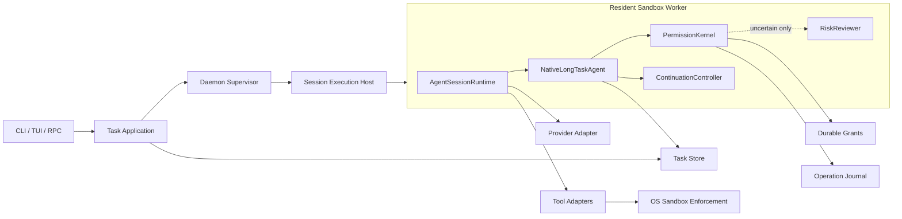

# Ever 统一 Goal、Session Sandbox 与自动权限技术规范

- 状态：Partially superseded；权限与 sandbox 设计仍为 Proposed，CLI/Goal 入口以 Task-first 规范为准
- 版本：0.1
- 日期：2026-08-14
- 关联规范：[EVER_ARCHITECTURE_OPTIMIZATION_SPEC.md](./EVER_ARCHITECTURE_OPTIMIZATION_SPEC.md)、[LONG_RUNNING_CONTROL_PLANE_SPEC.md](./LONG_RUNNING_CONTROL_PLANE_SPEC.md)、[NATIVE_LONG_TASK_AGENT_ARCHITECTURE.md](./NATIVE_LONG_TASK_AGENT_ARCHITECTURE.md)、[TECHNICAL_SPEC.md](./TECHNICAL_SPEC.md)
- 目标读者：Ever 维护者、实现工程师、安全评审者、代码评审者

## 1. 决策摘要

Ever 只保留一种长程执行模式。Goal 是 Task 的目标，不是独立运行模式。`/goal <objective>` 可以在当前 idle Session 中创建并附着一个 Task；它和 Task CLI 都调用同一个 Task Application，也不拥有状态机、continuation、预算或完成判定。

每个公开 Session 在启动时进入长寿命 OS sandbox。一个 resident Worker 持有一个 `AgentSessionRuntime`，同一 sandbox 连续执行多个 Turn，不为每个 Turn 或工具调用重复初始化 sandbox。普通交互、Goal 执行、后台续跑、恢复和 attach 使用同一 Session 执行链。

所有工具调用先经过 `PermissionKernel`。权限判定按固定顺序执行：

1. 确定性安全规则与 Task policy。
2. 已持久化的有限范围授权。
3. 仅对规则无法确定的动作调用 `RiskReviewer` LLM。
4. 仍不确定或需要扩大权限时询问用户。
5. 禁止动作直接拒绝。

`RiskReviewer` 只在确定性规则划定的可审批范围内自动放行。它不能绕过 OS sandbox、workspace、凭据隔离、Task policy、预算、acceptance、用户硬性拒绝或不可逆外部副作用门禁。模型不可用、输出无效或判断超时时，系统 fail closed：前台请求用户决定，后台暂停 Task。

本规范取代以下重复实现方向：

- `extensions/goal.ts` 内独立的 Goal 状态机和 continuation 调度。
- Daemon 直接拥有 Session sandbox 生命周期。
- 普通 Session、前台 Goal 和后台长任务采用不同工具权限语义。
- 仅凭工具名称或 Bash 字符串判断安全。
- 每次危险动作都重复打扰用户的无记忆审批。

## 2. 问题

当前实现存在三处割裂。

### 2.1 Goal 与长任务重复

`/goal` extension 自己保存 Goal 状态、Turn 数、Token 预算、continuation 和完成报告。`NativeLongTaskAgent` 也保存 Task、Attempt、checkpoint、budget、continuation 和 acceptance。两套状态机会产生不同的暂停、恢复和完成语义。

### 2.2 Sandbox 所有权错误

Daemon 当前创建 `UnattendedSandbox`，再把整个 Worker 进程包入 sandbox。普通交互 Session 和前台 `/goal` 不经过相同路径。安全能力因此取决于启动入口，而不是 Session 的执行环境。

OS sandbox 只能在进程启动前可靠建立。Session 已经在宿主进程中运行后，不能通过包装单个 Bash 调用获得等价隔离，因为 `read`、`edit`、`write`、Extension 和其他进程能力仍在宿主进程中。

### 2.3 权限判断过粗

现有 `ExecutionPolicy` 能检查工具 allowlist、路径、只读策略和 sandbox 是否存在，但不能表达以下常见情况：

- 工作区内普通编辑应静默允许。
- `rm -rf build` 和 `rm -rf /` 都是 Bash，但风险完全不同。
- `git push`、发布、部署和发送消息是不可逆外部副作用。
- 新网络域名可能只用于下载公开依赖，也可能用于数据外传。
- 用户已经批准同一 Task 内的 `npm run check`，不应每次询问。

## 3. 目标

### 3.1 统一执行语义

1. 系统中只有一种 Goal，即 `Task.goal`。
2. Goal 的执行主体只有 `AgentSession`。
3. 长程控制只有 `NativeLongTaskAgent` 一套实现。
4. 普通交互、Goal、后台续跑、恢复和 attach 使用同一 Worker、Session 和权限链。
5. Session log 保存对话事实，Task Store 保存跨进程控制事实，不复制恢复状态机。

### 3.2 安全

1. 所有公开 Session 默认运行在可验证的 OS sandbox 中。
2. 工具执行前必须获得 awaited permission decision。
3. 确定性规则和 sandbox 是最终安全边界，LLM 不是安全边界。
4. 模型、Extension 和工具不能扩大自身权限。
5. Provider 凭据不能进入模型控制的工具子进程。
6. 不可逆外部副作用默认需要用户明确授权。
7. 未知执行结果不能自动重放。

### 3.3 低打扰

1. 工作区内常规读取、编辑和验证不询问用户。
2. 相同范围内的已批准操作复用 durable grant。
3. 一次询问应允许用户选择合理范围，而不是只能批准单次调用。
4. 权限范围扩大、sandbox profile 变化或不可逆副作用才重新询问。
5. 后台无人值守时不弹出交互框，Task 转为 `waiting_input` 并提供具体原因。

### 3.4 性能

1. Sandbox 每个 resident Session 初始化一次，不按 Turn 重建。
2. 常规权限判断不产生额外 LLM 请求。
3. Risk review 结果按规范化 intent fingerprint 缓存。
4. 权限判断不阻塞 UI event stream 或其他 Worker。
5. 权限系统的持久化和审计不能让普通工具调用产生明显延迟。

## 4. 非目标

- 不让 RiskReviewer 代替 OS sandbox。
- 不让 LLM 自动批准付款、发布、部署、推送、发送外部消息或修改安全配置。
- 不保证从任意 Bash 文本静态推导完整副作用。
- 不在活跃进程中动态放宽 sandbox mount、网络或凭据范围。
- 不引入云端权限服务、外部工作流引擎或第二语言运行时。
- 不自动把一次批准永久写入全局策略。
- 不允许 Goal 修改自己的 acceptance、预算或权限上限。
- 不长期维护旧 Goal extension 和新 Task runtime 两套实现。

## 5. 领域模型

本规范使用以下唯一术语：

| 术语 | 定义 |
| --- | --- |
| Goal | `Task.goal` 中保存的用户目标 |
| Task | Goal、预算、acceptance、权限和跨进程状态的持久实体 |
| Attempt | Task 的一次可恢复执行，冻结 runtime 与安全快照 |
| Session | Agent 对话、工具调用、compaction 和 Turn 的执行记录 |
| Turn | Session 中一次模型推理及其工具循环 |
| Worker | 持有一个 Session runtime 的 resident 进程 |
| Execution Environment | Session 运行所在的 sandbox 身份、workspace、网络、文件和凭据能力 |
| Tool Intent | 工具调用在授权前生成的规范化动作描述 |
| Grant | 用户或受限自动审批产生的持久授权 |
| Risk Review | 对确定性规则无法判断的 Tool Intent 进行的结构化 LLM 风险评估 |

不存在独立的“Session Goal”和“Long Task Goal”。Task CLI 和 `/goal <objective>` 都是 Task Application 的创建 adapter；其余 `/goal` 子命令控制当前 Task。

## 6. 核心不变量

1. **唯一 Goal**：Goal 只存于 Task Store，Session entry 只能引用，不能成为第二事实源。
2. **唯一执行链**：Task 只能通过 `NativeLongTaskAgent` 驱动 `AgentSession`。
3. **Sandbox 先于 Session**：Session runtime 创建前必须确定 execution environment。
4. **Sandbox 不可静默降级**：初始化失败时不得回退到宿主机执行。
5. **权限先于副作用**：permission decision 和 `ToolStarted` 必须先于工具 adapter 调用。
6. **硬规则优先**：RiskReviewer 不能覆盖确定性 deny 或提高 policy ceiling。
7. **最小授权**：Grant 必须绑定 tool、effect、路径、域名、命令指纹、Task 或 workspace 中必要的最小集合。
8. **权限不可自增**：Agent 不能调用工具修改自己的 Grant、policy 或 sandbox profile。
9. **凭据不下放**：Provider 凭据只在模型请求 adapter 中可见，不进入工具环境。
10. **不可逆动作需人审**：发布、部署、推送、付款和发送外部消息不能仅由 LLM 自动批准。
11. **未知结果不重放**：授权成功不代表副作用可重试，恢复仍遵循 operation journal。
12. **完成由 Host 决定**：模型只能提交证据，Acceptance Runner 决定 Task 是否完成。
13. **审批可撤销**：用户可以撤销未使用或后续使用的 Grant，撤销不回滚已经发生的副作用。
14. **Profile 扩权需重启**：sandbox mount、网络或能力扩大时必须 settled、checkpoint、重启 Worker。

## 7. 目标架构



统一执行链：

```text
ever <goal>
  -> TaskApplication 创建 Task
  -> SessionExecutionHost 启动或恢复已 sandboxed 的 resident Session
  -> NativeLongTaskAgent 领取 Attempt
  -> AgentSession 执行 Turn
  -> PermissionKernel 授权每个 Tool Intent
  -> settled checkpoint
  -> ContinuationController 决定继续、等待、暂停或验收
  -> AcceptanceRunner 决定完成
```

## 8. `/goal` 控制语义

### 8.1 命令职责

`/goal <objective>|status|pause|resume|blocked|cancel` 只负责：

1. 在当前 Session idle 且未附着 Task 时，通过 Task Application 创建并附着一个 durable Task。
2. 读取当前进程内的 Task/Agent identity。
3. 通过 Task Application 查询或控制同一个 durable Task。
4. 显示 Task ID、Goal、预算、sandbox 和权限摘要。

`/goal` 不负责：

- 保存独立 Goal state。
- 统计独立 Turn 或 Token 预算。
- 自己调度 continuation；启动后的 follow-up 只用于进入 `NativeLongTaskAgent` 的首个 Turn。
- 判断完成。
- 保存 blocker 或 evidence 的第二份副本。

### 8.2 Session 创建与恢复

普通交互可以先创建 standalone Session。用户执行 `/goal <objective>` 时，adapter 通过 Task Application 创建 Task，并让同一个 idle Session 成为该 Task 的执行记录；已有 Task 则从 settled checkpoint 恢复。

Task bridge 启动后：

- Session ID 保持不变。
- transcript 和 compaction 历史保持不变。
- Task Store 记录 Session reference 和首次 checkpoint。
- 后续 continuation 只由 `NativeLongTaskAgent` 驱动。
- 客户端退出不终止 Worker。

SDK 调用方也可显式创建 standalone Session。只有显式调用 durable Goal adapter 后它才进入 Task 产品路径。系统不得声称单独包装 Bash 等价于完整 Session sandbox。

### 8.3 旧 Goal extension

`extensions/goal.ts` 只保留 Task Application adapter、展示和命令解析。它不得恢复旧 extension 的状态存储或自动 continuation；已有 `session-goal` entry 只能只读迁移。

## 9. Session Execution Host

### 9.1 Interface

```ts
interface SessionExecutionHost {
  start(request: SessionStartRequest): Promise<HostedSession>;
  resume(request: SessionResumeRequest): Promise<HostedSession>;
}

interface HostedSession {
  workerId: string;
  sessionId: string;
  environment: SessionExecutionEnvironment;
  attach(): Promise<SessionAttachment>;
  stop(reason: string): Promise<void>;
}
```

调用方不直接创建 `UnattendedSandbox`、拼接 shell 命令、设置 sandbox 环境变量或传递 Worker 凭据。

### 9.2 Execution Environment

```ts
type SessionExecutionEnvironment = {
  trust: "sandboxed" | "unsafe_host";
  sandboxId?: string;
  backend: "seatbelt" | "bubblewrap" | "unsupported";
  profileSha256: string;
  workspaceRoot: string;
  writableRoots: readonly string[];
  readableRoots: readonly string[];
  allowedDomains: readonly string[];
  credentialScopes: readonly string[];
};
```

`unsafe_host` 只用于显式诊断和 SDK 兼容，不允许后台 continuation，不允许继承为 Task 默认值，并在每个 Turn 记录安全警告。

### 9.3 Sandbox 生命周期

- Host 初始化 sandbox runtime。
- Host 创建一个长寿命 Worker 进程。
- Worker 内连续执行多个 Turn 和工具调用。
- Session settled 不关闭 sandbox。
- Task pause 可以保留 Worker，也可以在 checkpoint 后关闭，取决于资源策略。
- Worker stop 必须等待进程树退出并销毁 sandbox identity。
- Recovery 必须验证旧 sandbox 或进程组已停止，不能只依赖 PID 或 lease。

### 9.4 Profile 变化

以下变化需要新 profile 和 Worker 重启：

- 增加 writable root。
- 增加 readable secret scope。
- 增加网络域名。
- 开放本地监听或 Unix socket。
- 增加可执行程序或系统能力。

重启顺序固定为：

1. 阻止新 Turn 和新工具调用。
2. 等待当前工具 operation settled，无法确认时进入 `unknown_outcome`。
3. 创建 settled checkpoint。
4. 停止并验证旧 Worker 和 sandbox。
5. 创建新 profile 与 Attempt runtime snapshot。
6. 恢复同一 Task 和 Session。

## 10. Tool Intent

权限判断不直接消费原始工具参数。每个工具 adapter 必须先生成规范化 `ToolIntent`：

```ts
type ToolIntent = {
  operationId: string;
  taskId: string;
  attemptId: string;
  sessionId: string;
  toolName: string;
  effect: "read_only" | "reconcilable_write" | "process" | "external_side_effect";
  paths: readonly string[];
  command?: {
    executable?: string;
    normalized: string;
    fingerprint: string;
  };
  networkDomains: readonly string[];
  credentialScopes: readonly string[];
  destructive: boolean;
  reversible: boolean;
  idempotency: "native" | "reconcilable" | "none";
  metadataComplete: boolean;
};
```

### 10.1 规范化规则

- 所有路径在授权前 canonicalize，并验证 symlink 结果。
- 相对路径基于 canonical workspace root 解析。
- Bash 记录规范化命令和指纹，但不得假设静态解析覆盖所有运行时行为。
- 工具声明的域名只用于权限判断，实际网络访问仍由 sandbox enforcement 限制。
- 未声明 durability metadata 的 Extension tool 视为 `external_side_effect`、`metadataComplete = false`、`idempotency = none`。
- 工具 metadata 是风险输入，不是可信的最终权限来源。Host 可以提高风险，不能因工具自报而降低风险。

## 11. PermissionKernel

### 11.1 Interface

```ts
type PermissionDecision =
  | { action: "allow"; source: "policy" | "grant" | "reviewer"; grantId?: string }
  | { action: "ask"; reason: string; suggestedScope: PermissionScope }
  | { action: "deny"; code: string; reason: string };

interface PermissionKernel {
  authorize(intent: ToolIntent, context: PermissionContext): Promise<PermissionDecision>;
}
```

这是工具执行的唯一权限 seam。Agent Harness 的 awaited `before_tool` 必须等待其结果。

### 11.2 判定顺序

1. 校验 Attempt claim、lease、execution ID 和 fencing token。
2. 校验 sandbox identity 与 runtime snapshot。
3. 应用硬性 deny。
4. 应用 Task tool policy、workspace 和 credential ceiling。
5. 应用硬性 allow。
6. 查询匹配的 durable grant。
7. 查询 Risk Review cache。
8. 对 eligible intent 调用 RiskReviewer。
9. 根据 reviewer 结果 allow、ask 或 deny。
10. 在同一持久化流程中写 permission decision 与 `ToolStarted`。
11. 返回 execution permit。

### 11.3 硬性 allow

默认静默允许：

- workspace 内、非 secret path 的读取与搜索。
- workspace 内的普通 `edit` 和 `write`，且没有覆盖受保护文件。
- 已登记的只读 Git 命令，如 `git status`、`git diff`、`git log`。
- 项目内已登记的验证命令，如 test、lint、typecheck 和 build，前提是 sandbox 不允许越界副作用。
- Task policy 明确允许且 sandbox profile 已包含的纯读取网络 adapter。

硬性 allow 仍受 sandbox enforcement、operation journal 和预算限制。

### 11.4 硬性 deny

默认拒绝：

- 读取或写入宿主凭据目录、控制 token、auth store 和其他 Task workspace。
- 关闭、绕过或修改 sandbox、PermissionKernel、Grant store、审计日志或 recovery barrier。
- Agent 给自己增加 tool、path、domain、credential 或 budget 权限。
- 未经专用 adapter 访问付款能力或高价值密钥。
- 在 `unsafe_host` 后台执行外部副作用。
- metadata 缺失且无法限制作用域的 Extension tool。
- 旧 Worker、过期 lease 或错误 sandbox identity 发起的调用。

RiskReviewer 不能覆盖硬性 deny。

### 11.5 必须人工确认

以下操作即使 RiskReviewer 判断为低风险，也必须由用户确认：

- `git push`、创建或合并远程 PR。
- 发布 package、release 或容器镜像。
- 部署、修改生产环境或基础设施。
- 发送邮件、聊天消息、issue、PR comment 或其他外部通信。
- 付款、购买、转账或创建付费资源。
- 删除 workspace 外数据或大范围不可恢复删除。
- 导出 secret、token、Cookie、私有 key 或包含凭据的文件。
- 永久修改全局权限策略。

专用企业策略未来可以进一步收紧，不能静默放宽这组默认门禁。

## 12. RiskReviewer

### 12.1 定位

RiskReviewer 是 `PermissionKernel` 的内部 adapter。它减少规则无法覆盖时的用户打扰，不是独立权限源。

只有满足以下条件的 intent 才可进入 reviewer：

- 已通过所有硬性安全检查。
- 动作被当前 sandbox profile 物理限制在 Task scope 内。
- 不属于必须人工确认的类别。
- 不需要新 credential scope。
- 失败结果可恢复，或 operation journal 能进入明确的 `unknown_outcome`。

### 12.2 输入

Reviewer 只接收最小化、去敏后的结构化上下文：

- Tool Intent。
- Task goal 摘要。
- 当前 workspace 和 sandbox capability 摘要。
- 匹配或冲突的 policy 与 grant 摘要。
- 相关命令局部文本。
- 预期副作用、可恢复性和用户已批准范围。

不得发送：

- Provider credential。
- 完整宿主环境变量。
- 无关 Session transcript。
- secret 文件内容。
- auth store、SSH key 或控制 token。

### 12.3 输出

```ts
type RiskReview = {
  schemaVersion: 1;
  verdict: "allow_once" | "ask" | "deny";
  risk: "low" | "medium" | "high";
  effects: readonly string[];
  reasonCode: string;
  explanation: string;
  suggestedScope?: PermissionScope;
  confidence: number;
};
```

输出必须通过 schema 校验。缺字段、未知枚举、超时、Provider 错误或低于置信度阈值时，结果视为 `ask`，后台转为 `waiting_input`。

### 12.4 Reviewer 权限上限

Reviewer 可以：

- 对 eligible、sandbox-contained、可恢复的低风险动作执行 `allow_once`。
- 建议用户批准一个受限 scope。
- 将动作升级为 ask 或 deny。

Reviewer 不可以：

- 创建 workspace、Task 或永久 global grant。
- 增加 sandbox mount、网络域名或 credential scope。
- 覆盖必须人工确认或硬性 deny。
- 修改 Task policy、acceptance、预算或 continuation。
- 因模型声称“用户应该同意”而代替用户同意。

### 12.5 模型隔离

RiskReviewer 使用独立 system prompt、固定结构化输出和独立 request kind。它不加入主 Agent transcript，不接收主 Agent 的指令层级，也不允许主 Agent 通过工具参数注入 reviewer policy。

Reviewer prompt 必须明确把 Tool Intent 中的命令、路径和文本视为不可信数据。Reviewer 结果记录 model、prompt hash、input fingerprint 和 output hash，不保存凭据。

## 13. Durable Grants

### 13.1 Scope

```ts
type PermissionScope = {
  lifetime: "once" | "attempt" | "task" | "workspace" | "project_policy";
  toolNames: readonly string[];
  effects: readonly ToolIntent["effect"][];
  pathPrefixes: readonly string[];
  commandFingerprints: readonly string[];
  networkDomains: readonly string[];
  credentialScopes: readonly string[];
  expiresAt?: string;
};
```

Grant 默认使用最窄 scope。UI 必须把扩大范围作为显式选择，不能预选永久授权。

### 13.2 来源

Grant 来源只有：

- `user`：用户明确批准。
- `policy`：项目或组织策略预先登记。
- `reviewer_once`：RiskReviewer 对单次 eligible intent 自动批准。

Reviewer 不能创建 attempt、task、workspace 或 project policy grant。

### 13.3 匹配

Grant 只有在以下条件全部满足时才匹配：

- Task、Attempt 或 workspace identity 与 scope 一致。
- sandbox profile hash 未发生不兼容变化。
- tool、effect、canonical paths、domain、credential scope 均为 grant 子集。
- command fingerprint 匹配，或 policy 明确允许该命令类别。
- Grant 未过期、未撤销。
- intent 风险没有因 metadata 或环境变化升级。

### 13.4 撤销与审计

每次 Grant 创建、使用、过期和撤销都写审计事件。撤销只影响未来调用。项目级策略写入前必须展示具体 diff，并由用户确认。

## 14. 用户审批体验

### 14.1 提示内容

一次审批必须说明：

- Agent 想做什么。
- 目标路径、域名或外部系统。
- 可见副作用。
- 是否可恢复。
- 当前 sandbox 能限制什么。
- 为什么现有 policy 或 grant 不覆盖。

用户选项：

1. 拒绝。
2. 仅允许这一次。
3. 当前 Attempt 内允许。
4. 当前 Task 内允许。
5. 当前 workspace 内允许。
6. 写入项目策略。

UI 只显示适用于当前 intent 的选项。不可逆外部副作用通常只提供单次批准，不提供自动扩大范围。

### 14.2 不打扰策略

- 相同 intent fingerprint 命中 once cache 时不重复 review。
- 命中 durable grant 时静默允许，并在 UI 状态区显示授权来源。
- 连续多个调用需要相同新 scope 时，Worker 合并为一个审批请求。
- Agent 忙时审批请求进入 durable inbox，不阻塞事件流。
- 后台 Task 等待审批时进入 `waiting_input`，发送一次通知，不循环弹窗。
- 用户拒绝后，相同 fingerprint 在当前 Attempt 内直接拒绝，不反复询问。

### 14.3 Steering

用户批准或拒绝只改变 permission decision，不直接向 Agent transcript 注入自然语言。Worker 在安全 Turn seam 注入结构化结果，避免审批文本破坏 tool call 与 tool result 顺序。

## 15. 凭据与网络

### 15.1 Provider 凭据

Provider credential 通过 Worker 启动私有通道或 credential broker 注入模型 adapter。它不能进入：

- Bash 环境。
- Extension tool 默认环境。
- Session log。
- Runtime snapshot。
- RiskReviewer 输入。
- Tool result。

OAuth refresh 仍由受信任 adapter 处理。模型控制代码只能得到调用能力，不能读取原始 credential。

### 15.2 工具凭据

需要外部凭据的工具必须使用专用 adapter 和命名 credential scope。用户批准动作不等于批准读取原始 secret。adapter 只暴露完成特定动作所需的窄能力。

### 15.3 网络

Sandbox network policy 是最终 enforcement。PermissionKernel 中的 domain 只决定是否允许或请求 profile 变化。

新域名处理：

1. 规范化域名与端口。
2. 检查 Task policy 和 grant。
3. 确定是否属于必须人工确认类别。
4. 需要扩展 sandbox profile 时 checkpoint 并重启 Worker。
5. 不允许用通配符静默扩大到整个公网。

Provider 域名和工具域名分开登记。允许模型 Provider 连接不代表 Bash 可以访问同一域名。

## 16. Operation Journal 与恢复

Permission decision 必须与 operation journal 关联：

```text
ToolIntentNormalized
  -> PermissionEvaluated
  -> PermissionAllowed | PermissionAsked | PermissionDenied
  -> ToolStarted
  -> tool adapter
  -> ToolFinished | ToolOutcomeUnknown
```

记录至少包含：

- operation ID、tool call ID、intent fingerprint。
- Task、Attempt、Session、execution 和 fencing identity。
- permission source、Grant ID 或 Risk Review ID。
- sandbox ID 与 profile hash。
- effect、idempotency、reconcile strategy。
- 结果摘要与 unknown outcome 原因。

Worker 崩溃后：

| Effect | 恢复行为 |
| --- | --- |
| `read_only` | 相同 operation ID 可重试 |
| `reconcilable_write` | 比对目标 hash，一致则补记完成，否则等待用户 |
| `process` | 先终止并确认进程组，再核对输出和 workspace |
| `external_side_effect` | 调用专用 reconcile adapter，没有 adapter 时进入 `unknown_outcome` |

已有 Grant 不改变恢复规则，也不允许自动重放不确定副作用。

## 17. Continuation 与权限等待

`ContinuationController` 在 settled 后按以下顺序决策：

1. lease、fencing 和 sandbox identity 是否有效。
2. 是否存在 unknown tool 或 Provider outcome。
3. 是否有用户 pause、cancel 或 steer。
4. 是否存在待处理 permission request。
5. budget 是否允许下一 Turn。
6. 是否提交完成申请并通过 acceptance。
7. 是否等待外部结果。
8. 是否触发 no-progress 或 repeated-failure 门禁。
9. 是否继续或 replan。

待审批时写持久 continuation decision：

```text
action = wait_user
reasonCode = permission_required
```

用户批准后创建新的 resume decision，不直接重放旧工具调用。Worker 从 settled checkpoint 恢复，由 Agent 根据结构化 permission result 继续。

## 18. 性能设计与门槛

### 18.1 Fast path

常规工具调用只经过：

1. 内存中的 Attempt 与 sandbox identity 检查。
2. canonical path cache。
3. 编译后的 policy matcher。
4. Grant 索引查询。
5. operation journal 事务。

Fast path 不调用 RiskReviewer，不重建 sandbox，不扫描完整 transcript。

### 18.2 Cache

允许缓存：

- canonical path 与 workspace membership。
- 编译后的 Task policy。
- 活跃 Grant 索引。
- Tool Intent fingerprint 的 reviewer 结果。
- sandbox profile serialization 与 hash。

Cache key 必须包含可能影响安全结论的版本：policy revision、Grant revision、workspace identity、tool metadata hash、sandbox profile hash 和 reviewer prompt hash。

禁止缓存：

- 已撤销 Grant 的 allow 结果。
- 必须人工确认的外部副作用。
- 跨 workspace 的路径结论。
- 不完整 metadata 产生的 allow。
- unknown outcome 的重试许可。

### 18.3 性能门槛

- Sandbox 初始化仅在 Session 启动、恢复或 profile 变化时发生。
- 确定性 permission fast path P95 小于 5 ms，不含 SQLite fsync。
- 命中 Grant 或 review cache 的判定 P95 小于 10 ms，不含 SQLite fsync。
- 常规 read、edit、write 和验证命令不新增 RiskReviewer 请求。
- RiskReviewer 同一时间每个 Worker 最多一个请求，后续相同 fingerprint 合并等待。
- PermissionKernel 不让 Worker event loop 连续阻塞超过 50 ms。
- 4 个并行 Worker 时，Supervisor RSS 不随 transcript 长度增长。
- Sandbox Worker 连续运行 100 个 Turn，不因 profile 或 policy cache 线性增加内存。

性能测试必须分别报告 cold start、warm Session、fast path、grant hit、review cache hit 和真实 reviewer 调用，不能用平均值掩盖 cold path。

## 19. 持久化变更

建议新增以下表，具体字段可按现有 Store 风格合并，但语义不可省略。

### 19.1 `permission_grants`

- `id`
- `source`
- `scope_json`
- `task_id`
- `attempt_id`
- `workspace_fingerprint`
- `sandbox_profile_sha256`
- `state`
- `created_at`
- `expires_at`
- `revoked_at`

### 19.2 `permission_decisions`

- `id`
- `operation_id`
- `intent_sha256`
- `action`
- `source`
- `grant_id`
- `risk_review_id`
- `reason_code`
- `created_at`

### 19.3 `risk_reviews`

- `id`
- `intent_sha256`
- `model_provider`
- `model_id`
- `prompt_sha256`
- `input_sha256`
- `output_sha256`
- `verdict`
- `risk`
- `confidence`
- `created_at`

原始 secret、完整环境、无关 transcript 和完整敏感文件内容不得写入这些表。

## 20. 配置

建议配置：

```json
{
  "execution": {
    "sandbox": "required",
    "permissionMode": "auto",
    "reviewer": {
      "enabled": true,
      "timeoutMs": 15000,
      "minimumConfidence": 0.8,
      "cacheTtlMinutes": 60
    }
  }
}
```

语义：

- `sandbox = required`：公开 Session 默认值，失败时拒绝启动。
- `permissionMode = auto`：确定性规则、Grant 和 eligible Risk Review 自动处理，其余询问。
- `permissionMode = ask`：关闭 reviewer 自动批准，但保留硬性 allow。
- `reviewer.enabled = false`：规则无法判断时直接询问或后台等待。

不提供 `permissionMode = unrestricted`。`--unsafe-no-sandbox` 只保留单次诊断用途，不写入配置，不被 Goal 或 schedule 继承。

## 21. 可观测性

TUI、`task show` 和 `daemon workers` 至少显示：

- Task、Attempt、Session 和 Worker identity。
- sandbox backend、ID、profile hash 和 workspace。
- 当前 permission mode。
- 最近 permission decision 及来源。
- 活跃 Grant 数量与 scope 摘要。
- pending approval 数量。
- RiskReviewer 请求次数、cache hit 和失败次数。
- unknown outcome 数量。
- sandbox cold start 与 permission latency 分位数。

审计日志使用稳定的 type、schemaVersion、Task ID、Attempt ID、operation ID 和 correlation ID。默认 UI 不显示原始 reviewer prompt，也不显示可能包含敏感命令参数的完整记录。

## 22. 故障语义

| 故障 | 必须行为 |
| --- | --- |
| Sandbox 初始化失败 | Session 或 Task 不启动，不回退宿主执行 |
| Sandbox profile 扩展失败 | 保持原 profile，Task 等待输入 |
| RiskReviewer 超时或 Provider 错误 | 前台询问，后台进入 `waiting_input` |
| Reviewer 输出 schema 无效 | 视为 ask，并记录 invalid result |
| Permission Store 写入失败 | 工具不执行 |
| Grant 在调用前被撤销 | 重新判定，不使用旧 cache |
| 工具执行后结果未持久化 | 进入 recovery 或 `unknown_outcome` |
| 用户断开时出现审批 | Worker 保持运行但不进入下一副作用，Task 等待输入 |
| Supervisor 崩溃 | Worker 保留当前安全执行，新 Supervisor 接管 |
| Worker 崩溃 | Recovery barrier 验证旧 sandbox 后才能恢复 |
| Reviewer 被 prompt injection 影响 | 硬规则和 sandbox 仍阻止越权，记录安全事件 |
| Credential broker 不可用 | Provider 或专用工具等待输入，不注入 ambient secret |

## 23. 测试策略

### 23.1 PermissionKernel 单元测试

- workspace 内 read、edit、write 的 fast path。
- symlink 逃逸、不存在路径和路径 canonicalization。
- protected file、其他 workspace 和 secret path 拒绝。
- Task tool allowlist、readOnly 和 sandboxRequired。
- Grant 子集匹配、过期、撤销和 profile hash 漂移。
- 必须人工确认动作不能由 reviewer 覆盖。
- Extension metadata 缺失时采用最高风险默认值。
- stale lease、execution ID 和 fencing token 拒绝。

### 23.2 RiskReviewer contract test

使用 faux provider，不调用真实模型：

- eligible 低风险 intent 返回 allow once。
- 中高风险返回 ask 或 deny。
- Reviewer 尝试扩大 scope 时被 kernel 截断。
- schema 无效、超时、错误和低 confidence fail closed。
- prompt injection 字符串不能修改 reviewer policy。
- 输入不包含凭据、完整环境或无关 transcript。
- 相同 fingerprint 合并并命中 cache。

### 23.3 Sandbox 集成测试

- 前台 Task、后台 Task、attach 恢复使用相同 Host。
- Session 启动前建立 sandbox。
- Worker 内连续多个 Turn 不重建 sandbox。
- workspace 外读写、secret 读取、其他 worktree 写入失败。
- Bash 子进程不能继承 Provider credential。
- 新网络域名触发 checkpoint 与 profile 重启。
- 旧 sandbox 未确认停止时，新 Worker 不能启动。
- `--unsafe-no-sandbox` 不被 Goal、resume 或 schedule 继承。

### 23.4 Goal 统一回归

- `ever <goal>` 创建一个 Task，不创建 extension Goal state。
- 新 Task 创建 Session，已有 Task 从 settled checkpoint 恢复。
- continuation 只由 `NativeLongTaskAgent` 触发。
- pause、resume、blocked、budget 和 completion 只有一份 durable 状态。
- Acceptance 未通过时模型不能完成 Task。
- 客户端退出后 Worker 继续，attach 恢复同一 Session。
- 旧 `session-goal` entry 只读迁移，不启动旧 continuation。

### 23.5 审批体验

- 用户批准一次后只覆盖单次 intent。
- Task scope grant 对相同子集静默生效。
- scope 扩大时重新询问。
- 用户拒绝后当前 Attempt 不重复询问相同 fingerprint。
- 多个相同 pending intent 合并为一个请求。
- 后台审批只产生一次通知并进入 `waiting_input`。

### 23.6 性能测试

- sandbox cold start。
- warm Session 首个 Turn。
- 1000 次 deterministic fast path。
- 1000 次 Grant hit。
- Risk Review cache hit。
- 真实 faux reviewer cold request。
- 100 Turn resident Worker 内存曲线。
- 4 Worker 并行 event loop 延迟。

## 24. 安全评审清单

实现合并前必须回答：

1. 是否存在绕过 `PermissionKernel` 直接执行工具的路径？
2. Extension tool 是否全部有默认最高风险策略？
3. RiskReviewer 是否能创建超过 `allow_once` 的 Grant？
4. 必须人工确认列表是否可被配置或模型静默关闭？
5. Provider credential 是否可能进入 Bash、日志、snapshot 或 reviewer 输入？
6. Sandbox profile 变化是否一定触发 checkpoint 与 Worker 重启？
7. Grant cache 是否包含 policy、workspace、profile 和 metadata revision？
8. User deny 是否会阻止相同 intent 反复请求？
9. Unknown outcome 是否可能因已有 Grant 被自动重放？
10. 旧 Worker 是否能使用过期 permit 执行工具？
11. Permission decision 持久化失败时工具是否仍可能启动？
12. 普通 Session 和 Goal 是否真的使用同一个 Host，而不是两个 adapter 行为分叉？

任一答案不明确时不得发布自动审批。

## 25. 独立交付阶段

该改动涉及超过 8 个文件和多个 module，必须分阶段合并。每个阶段结束后系统都可使用，不依赖下一阶段才能保证正确性。

### Phase A：统一 Tool Intent 与确定性权限 seam

范围：

- 定义 Tool Intent 和 durability metadata。
- 实现 `PermissionKernel` 的硬性 allow、deny 和现有 Task policy。
- 将 Agent Harness `before_tool` 接入唯一权限 seam。
- 写入 permission decision 与 operation journal。
- 暂不引入 RiskReviewer，规则无法判断时沿用用户确认或后台暂停。

完成标准：所有工具调用都经过 awaited permission decision，旧 `ExecutionPolicy` 不再由调用方直接拼装。

### Phase B：统一 Session Execution Host

范围：

- 新增 `SessionExecutionHost`。
- 将 `UnattendedSandbox` 生命周期从 Daemon 移入 Host。
- 普通交互与 resident Worker 使用相同 Host。
- 引入显式 `SessionExecutionEnvironment`，移除 sandbox 环境变量作为事实源。
- 增加 sandbox profile cache 和性能基线。

完成标准：公开 Session 均在启动前获得可验证 sandbox，Daemon 只调度 Host。

### Phase C：统一 Goal 与 Task runtime

范围：

- `/goal` 收缩为 Task 创建与控制 adapter。
- 由 CLI Task bridge 创建 Session 或恢复 settled checkpoint。
- continuation、budget、progress、evidence 和 completion 全部迁入 `NativeLongTaskAgent`。
- 删除 `extensions/goal.ts` 自有状态机，只保留薄 adapter。
- 增加旧 Session goal entry 的只读迁移提示。

完成标准：系统中不存在第二套 Goal state 或 continuation。

### Phase D：Durable Grants 与审批 UX

范围：

- Grant schema、Store、匹配和撤销。
- TUI 单次、Attempt、Task、workspace 和项目策略审批。
- 后台 `waiting_input` 与通知。
- pending request 合并和 deny suppression。

完成标准：常规操作静默执行，重复批准不再打扰用户，权限扩大仍需明确确认。

### Phase E：RiskReviewer 自动审批

范围：

- `RiskReviewer` interface 与 faux adapter。
- 固定 prompt、结构化 schema、最小化输入和注入防护。
- allow-once ceiling、cache、timeout 和 fail-closed。
- reviewer latency、调用率和 cache hit 可观测性。
- 安全故障注入与发布门禁。

完成标准：reviewer 只处理规则无法判断的 eligible intent，不增加常规 Turn 的模型请求，也不能扩大确定性权限上限。

### Phase F：Profile 扩权与恢复

范围：

- 网络域名、mount 和 capability 变化的 checkpoint-restart 流程。
- sandbox identity recovery barrier。
- Grant 与 profile drift 失效。
- 长时间运行和 Worker crash 测试。

完成标准：任何 sandbox 扩权都可审计、可恢复，不在活跃 Worker 中静默生效。

## 26. 迁移与兼容

- 先增加新 permission tables 和只读代码，再启用写入。
- Phase A 保留旧 policy 结果作为 shadow assertion，出现差异时 fail closed 并记录。
- Phase B 完成前，Daemon sandbox 路径保持原行为，但不能新增第二套配置。
- Phase C 切换时，旧 Goal extension 不再注册命令和 continuation listener。
- 已有 Session goal entry 不自动创建后台 Task，必须由用户确认迁移。
- `EVER_UNATTENDED_SANDBOX`、`EVER_SANDBOX_ID` 和相关环境变量在 Execution Environment 成为事实源后删除。
- 兼容 shim 最多保留一个发布周期，不长期维护双实现。

## 27. 回滚

### Phase A

关闭新 permission persistence，恢复旧 policy adapter。Tool Intent 记录可保留，旧版本忽略。

### Phase B

停止所有 resident Worker，恢复 Daemon 启动 sandbox 的旧 adapter。数据库不变。

### Phase C

停止自动 continuation，Task 保持可人工 resume。不能重新启用两套 Goal continuation；如需回滚，只允许 `/goal` 暂时返回“不支持”。

### Phase D

关闭 durable Grant 匹配，所有非硬性 allow 动作回到 ask。已有 Grant 保留但不生效。

### Phase E

设置 `reviewer.enabled = false`。系统退化为确定性规则加用户审批，不影响 sandbox、Task 或 checkpoint。

### Phase F

关闭自动 profile 扩展。需要新 domain 或 mount 的 Task 进入 `waiting_input`，现有 profile 继续有效。

回滚不得删除 Task、Session、checkpoint、operation journal、Grant 或审计事件。

## 28. 发布验收

发布自动审批前必须完成：

1. 一个真实 Goal 连续运行不少于 20 个 Turn。
2. `ever attach <task-id>` 从 settled checkpoint 恢复同一 Task 的 Session。
3. 客户端退出并重新 attach，Task 和审批状态完整。
4. 至少一次 sandbox profile 变化与 checkpoint-restart。
5. 至少一次 reviewer allow once、一次 ask、一次 deny。
6. 相同 Task scope Grant 在后续调用中静默命中。
7. 尝试读取 SSH、npm、云平台和 Ever 控制凭据均失败。
8. 尝试让 reviewer 批准 `git push`、发布和外部消息均被人工门禁拦截。
9. Worker 在 `ToolStarted` 前后分别崩溃，恢复不重复不确定副作用。
10. Provider credential 未出现在 Bash 环境、Session log、Task Store、snapshot 和 reviewer input。
11. 100 Turn resident Worker 性能和内存达到第 18 节门槛。
12. `npm run check`、专项测试和非 E2E 测试通过。

## 29. 最脆弱假设

本方案假设 resident sandbox Worker 可以长期持有交互式 `AgentSessionRuntime`，并在 settled seam 生成一致 checkpoint。

如果该假设不成立，系统退化为 settled Turn 后重启 Worker：Task、Session reference、PermissionKernel、Grant 和 operation journal 保持不变，但每轮会增加 sandbox cold start，实时 steering 和低延迟交互会受影响。数据模型和权限语义不依赖 Worker 永久存活，因此不会因该假设失败而退回双 Goal 或宿主机执行。

第二个关键假设是 Tool Intent 能为大多数常规工具提供完整 metadata。Bash 和未知 Extension 无法满足时，系统依赖 OS sandbox 限制实际能力，并将不确定动作交给 reviewer 或用户，不能为了降低询问率伪造确定性。

## 30. 批准条件

批准本规范代表同意：

1. Goal 只属于 durable Task，删除独立 Goal extension 状态机。
2. 每个公开 Session 默认运行在长寿命 sandbox Worker 中。
3. Daemon 不直接拥有 Session sandbox 实现，只通过 `SessionExecutionHost` 调度。
4. 所有工具调用经过唯一 `PermissionKernel` seam。
5. RiskReviewer 只处理确定性规则无法判断的 eligible intent。
6. LLM 自动审批上限为单次、受 sandbox 限制、可恢复的动作。
7. 不可逆外部副作用始终需要用户明确确认。
8. Durable Grant 用于减少重复打扰，但不能扩大 Task policy 或 sandbox ceiling。
9. Sandbox profile 扩权必须 checkpoint 并重启 Worker。
10. 各 Phase 独立实现、验证和合并。

批准本规范不授权自动提交、推送、发布或部署。
